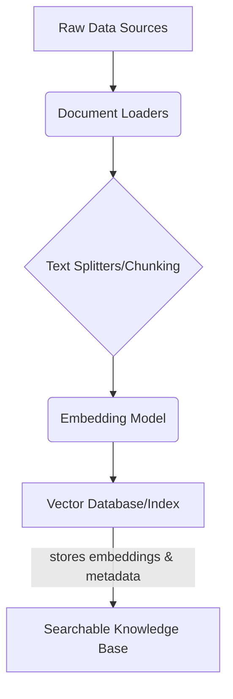
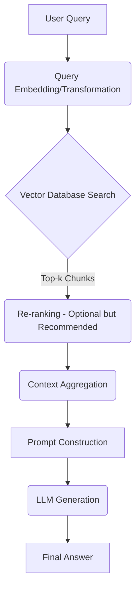
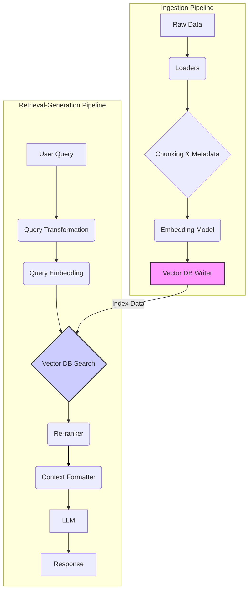

+++
title = "Beyond Basics: Architecting Robust RAG Pipelines for LLMs"
date = "2026-04-29"
tags = ["rag"]
categories = ["LLMs","AI Engineering"]
banner = "img/banners/2026-04-29-beyond-basics-architecting-robust-rag-pipelines-for-llms.jpg"
+++

The rise of Large Language Models (LLMs) has revolutionized how we interact with information. However, their inherent limitations—hallucinations, outdated knowledge, and lack of domain-specific context—often hinder their utility in enterprise applications. This is where Retrieval Augmented Generation (RAG) shines. Instead of a generic overview, this deep-dive explores the intricate architecture and critical engineering considerations required to build truly robust and performant RAG pipelines.

## The Fundamental Challenge: Bridging LLM Gaps

LLMs excel at linguistic tasks, but their knowledge is frozen at their last training cutoff. They cannot inherently access real-time data, internal documents, or specific domain knowledge without explicit instruction. RAG addresses this by augmenting the LLM's generative process with external, authoritative information retrieved at inference time. Think of it as giving the LLM an open-book exam, ensuring its answers are grounded and factual.

## Deconstructing the RAG Architecture: A Multi-Stage Journey

At its core, a RAG system involves two main phases: **indexing** (or ingestion) and **retrieval-generation**. Let's break down the components and their interplay.

### 1. The Ingestion Pipeline: Building Your Knowledge Base

The ingestion pipeline is where raw, unstructured data is transformed into an optimized, searchable vector index. This is a critical, often underestimated, phase that dictates the quality of subsequent retrieval.

#### 1.1. Data Loading & Preprocessing

Your journey begins with diverse data sources: PDFs, Notion pages, databases, websites, internal wikis, etc. Robust RAG systems must handle various formats.

```python
from langchain_community.document_loaders import PyPDFLoader, WebBaseLoader
from langchain_community.vectorstores import Chroma
from langchain_openai import OpenAIEmbeddings
from langchain_text_splitters import RecursiveCharacterTextSplitter

# Example: Loading documents
pdf_loader = PyPDFLoader("path/to/your/document.pdf")
web_loader = WebBaseLoader("https://www.datafibers.com/blog/rag-deep-dive")

docs = pdf_loader.load() + web_loader.load()
print(f"Loaded {len(docs)} documents.")
```

#### 1.2. Text Splitting (Chunking): The Granularity Dilemma

This is arguably the most impactful decision in RAG. LLMs have context windows, and embeddings work best on semantically coherent units. Choosing the right chunking strategy balances information density with retrieval precision.

*   **Fixed Size:** Simplest, but can cut off sentences or ideas.
*   **Recursive Character Text Splitter:** Attempts to preserve semantic units by splitting on a hierarchy of separators (e.g., `\n\n`, `\n`, ` `, `''`). This is a common and effective starting point.
*   **Semantic Chunking:** Advanced methods group sentences by semantic similarity, ensuring chunks are meaningful even if they span different structural elements.
*   **Parent Document Retrieval:** Stores small, semantically dense chunks for retrieval, but fetches a larger "parent" document for context feeding to the LLM. This mitigates the "lost in the middle" problem.

```python
text_splitter = RecursiveCharacterTextSplitter(
    chunk_size=1000, # A typical starting point
    chunk_overlap=200, # Important for maintaining context across chunks
    separators=["\n\n", "\n", " ", ""]
)

chunks = text_splitter.split_documents(docs)
print(f"Split into {len(chunks)} chunks.")

# Example of metadata addition (crucial for filtering)
for i, chunk in enumerate(chunks):
    chunk.metadata["chunk_id"] = f"chunk_{i}"
    chunk.metadata["source_type"] = "pdf" if "pdf" in chunk.metadata["source"] else "web"
    # Add more relevant metadata like author, date, department etc.
```

#### 1.3. Embedding Generation: Semantic Fingerprinting

Each chunk is converted into a high-dimensional vector (embedding) by an embedding model. This vector captures the semantic meaning of the text. Popular choices include OpenAI's `text-embedding-ada-002`, `Cohere` embeddings, or open-source models like `sentence-transformers`.

Considerations:

*   **Dimensionality:** Higher dimensions can capture more nuance but increase storage and computational cost.
*   **Performance:** Latency and throughput are key for large datasets.
*   **Domain Specificity:** Some models perform better on general text, others can be fine-tuned for specific domains.

```python
embeddings = OpenAIEmbeddings(model="text-embedding-ada-002")

# In a real scenario, you'd batch embed for efficiency.
# vector_embeddings = embeddings.embed_documents([chunk.page_content for chunk in chunks])
# print(f"Generated {len(vector_embeddings)} embeddings.")
```

#### 1.4. Vector Database: The Semantic Index

The generated embeddings, along with their original text and associated metadata, are stored in a vector database. These databases are optimized for Approximate Nearest Neighbor (ANN) search, enabling rapid retrieval of semantically similar chunks.

Popular Vector DBs:

*   **Cloud Managed:** Pinecone, Weaviate, Zilliz Cloud
*   **Self-Hosted/Hybrid:** Qdrant, Milvus, ChromaDB, pgvector

Key features to evaluate:

*   **Scalability:** Horizontal scaling for billions of vectors.
*   **Filtering:** Efficient metadata filtering (e.g., retrieve only documents from a specific department).
*   **Hybrid Search:** Combining vector similarity with keyword search (e.g., BM25).
*   **Cost:** Managed services vs. infrastructure burden.

```python
# Using Chroma as an in-memory or persistent local vector store for simplicity
# For production, integrate with a robust solution like Pinecone, Qdrant, etc.
vectorstore = Chroma.from_documents(documents=chunks, embedding=embeddings, persist_directory="./chroma_db")
vectorstore.persist()
print("Chunks and embeddings persisted to ChromaDB.")
```

Here's a simplified Mermaid diagram of the ingestion pipeline:



### 2. The Retrieval-Generation Pipeline: Answering Queries Intelligently

This is the runtime phase where a user's query is processed to fetch relevant context and generate a grounded response.

#### 2.1. Query Preprocessing & Transformation

Just as documents are embedded, the user's query is also embedded. Sometimes, the raw query isn't optimal for retrieval. Techniques include:

*   **Query Expansion:** Generating multiple reformulations of the query.
*   **Query Rewriting:** Simplifying or restructuring the query for better search.
*   **HyDE (Hypothetical Document Embedding):** Generating a hypothetical answer first, then embedding that to retrieve relevant documents.

#### 2.2. Semantic Retrieval

The embedded query is used to search the vector database for the `k` most similar chunks. This similarity is typically measured using cosine similarity or dot product.

```python
retriever = vectorstore.as_retriever(search_kwargs={"k": 5}) # Retrieve top 5 chunks

query = "What are the main benefits of DataFibers Community for AI Engineers?"
retrieved_docs = retriever.invoke(query)

print(f"Retrieved {len(retrieved_docs)} documents for the query.")
for i, doc in enumerate(retrieved_docs):
    print(f"-- Document {i+1} (Source: {doc.metadata.get('source', 'N/A')}):
{doc.page_content[:200]}...")
```

#### 2.3. Re-ranking: Enhancing Relevance

Initial vector search often returns documents that are semantically similar but not necessarily *most relevant* to the specific query intent. Re-ranking models, often fine-tuned transformer models (e.g., Cross-Encoders like `Rerank from Cohere`, `BERT-based re-rankers`), score the retrieved documents based on their direct relevance to the query. This significantly improves precision.

Considerations:

*   **Latency:** Re-rankers add latency, choose models carefully.
*   **Cost:** Inference cost per query.

```python
# Pseudocode for re-ranking (actual implementation would involve a dedicated re-ranking model)
# from sentence_transformers.cross_encoder import CrossEncoder
# model = CrossEncoder('cross-encoder/ms-marco-MiniLM-L-6-v2')

# query_document_pairs = [[query, doc.page_content] for doc in retrieved_docs]
# scores = model.predict(query_document_pairs)
# ranked_docs = [doc for _, doc in sorted(zip(scores, retrieved_docs), reverse=True)]
# print("Documents re-ranked.")

# For simplicity, we'll proceed with direct retrieved_docs in the LangChain example below
```

#### 2.4. Prompt Construction & LLM Generation

The re-ranked (or directly retrieved) chunks are then combined with the user's query into a carefully constructed prompt. This prompt instructs the LLM to synthesize an answer based *only* on the provided context.

```python
from langchain_openai import ChatOpenAI
from langchain_core.prompts import ChatPromptTemplate
from langchain_core.runnables import RunnablePassthrough
from langchain_core.output_parsers import StrOutputParser

# Define your LLM
llm = ChatOpenAI(model="gpt-4o", temperature=0.1)

# Define the prompt template
prompt_template = ChatPromptTemplate.from_messages([
    ("system", "You are a helpful assistant. Use the following retrieved context to answer the user's question. If you don't know the answer, state that you don't have enough information."),
    ("human", "Context: {context}\n\nQuestion: {question}")
])

# Build the RAG chain
rag_chain = (
    {"context": retriever, "question": RunnablePassthrough()}
    | prompt_template
    | llm
    | StrOutputParser()
)

# Invoke the chain
response = rag_chain.invoke(query)
print("\n--- Generated Response ---")
print(response)
```

Here's a simplified Mermaid diagram of the retrieval-generation pipeline:



### Architectural Integration: The Full Picture



## Advanced RAG Patterns & Considerations

Building on the foundational components, advanced RAG systems employ sophisticated strategies:

1.  **Multi-Query/Multi-Path RAG:** For complex questions, decompose them into sub-queries, execute RAG on each, and synthesize the results. This often involves an orchestrating LLM.
2.  **Hybrid Search:** Combining vector similarity with keyword search (e.g., BM25) significantly improves recall, especially for specific entities or rare terms.
3.  **Graph RAG:** For knowledge graphs, use graph traversals to find relevant nodes and relationships, then embed and retrieve those. This adds structured reasoning capabilities.
4.  **Self-RAG/Adaptive RAG:** The LLM itself decides when to retrieve, what to retrieve, and how to combine information. It can generate queries, critique retrieved documents, and adapt its strategy dynamically.
5.  **Small-to-Large Chunking / Sentence Window Retrieval:** Retrieve small, precise chunks for embedding similarity, but expand to a larger "window" of surrounding text when feeding to the LLM to provide richer context.
6.  **Query Decomposition & Routing:** An initial LLM step analyzes the query, decomposes it, and routes parts to different RAG indices or even different tools/APIs.

## Implementation Challenges & Best Practices

*   **Data Freshness & Sync:** Establish robust ETL pipelines to keep your vector database updated with the latest information. Consider change data capture (CDC).
*   **Metadata Management:** Rich metadata is crucial for effective filtering and targeted retrieval. Define schemas and enforce consistency.
*   **Evaluation:** Don't guess. Use metrics! Tools like `RAGAS` (faithfulness, answer relevance, context recall, context precision) and custom A/B testing are indispensable. Evaluate on a diverse set of real-world queries.
*   **Scalability:** Design your vector database and embedding services for anticipated query loads and data volume. Consider caching strategies.
*   **Latency & Throughput:** Optimize each step. Batching embeddings, efficient vector database indexing (e.g., HNSW), and fast LLM inference are key.
*   **Cost Optimization:** Monitor API costs for LLMs and embedding models. Explore open-source alternatives where appropriate.
*   **Security & Access Control:** Ensure your RAG system respects data access policies. Retrieve only documents the user is authorized to see.
*   **Monitoring & Observability:** Instrument your pipeline to track performance, errors, and user satisfaction.

## Conclusion

RAG is more than just throwing documents into a vector store and querying an LLM. It's a sophisticated engineering discipline that requires careful design, meticulous data management, and continuous evaluation. By understanding the "under-the-hood" mechanics—from chunking strategies and embedding models to re-ranking and advanced architectural patterns—you can build robust, reliable, and highly intelligent RAG systems that truly unlock the potential of LLMs for your DataFibers Community projects. The journey to a perfectly grounded LLM is ongoing, but RAG provides the most powerful toolkit we have today.