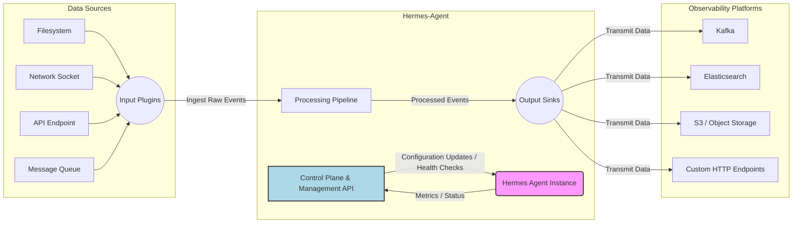

+++
title = "Hermes-Agent Under the Hood: Dissecting Its Architecture for Robust Data Ingestion"
date = "2026-05-13"
tags = ["hermes-agent"]
categories = ["Technology"]
banner = "img/banners/2026-05-13-hermes-agent-under-the-hood-dissecting-its-architecture-for-robust-data-ingestion.jpg"
+++

The landscape of modern distributed systems demands sophisticated solutions for collecting, processing, and routing operational data. Logs, metrics, and traces—often generated at immense scale across heterogeneous environments—are critical for observability. While many tools exist, the `hermes-agent` distinguishes itself by offering a highly configurable, resilient, and performant agent designed for these exact challenges.

This isn't a generic overview. We're diving deep into the `hermes-agent`'s internal workings, exploring its architectural patterns, data flow mechanisms, and how it tackles the practical complexities of distributed data ingestion.

## The Core Problem: Taming Distributed Data Chaos

Imagine a microservices architecture with hundreds of instances across multiple clusters, generating terabytes of data daily. Key challenges include:

1.  **Heterogeneous Sources:** Data originates from file systems, network sockets, message queues, APIs, and more.
2.  **Volume & Velocity:** Sheer data scale and high-speed generation require efficient processing to avoid backlogs.
3.  **Reliability:** Data loss is unacceptable. Agents must tolerate network glitches, downstream system failures, and their own restarts.
4.  **Transformation & Enrichment:** Raw data often needs filtering, parsing, and context enrichment (e.g., adding Kubernetes metadata) before storage or analysis.
5.  **Resource Constraints:** Agents run on production hosts and must be lightweight, minimizing CPU, memory, and network footprint.

`hermes-agent` is engineered to provide a robust solution to these problems, acting as the intelligent edge collector that bridges the gap between diverse data sources and centralized observability platforms.

## Hermes-Agent's Architectural Blueprint

At its heart, `hermes-agent` employs a modular, pipeline-driven architecture. Data flows through a series of stages: **Inputs**, **Processors**, and **Outputs**. A separate **Control Plane** manages the agent's lifecycle and configuration.

Let's visualize this core structure:



### Core Components Explained:

*   **Input Plugins:** These are responsible for sourcing raw data. Each plugin is tailored to a specific data source type (e.g., `file`, `http`, `kafka_consumer`). They ingest data and convert it into `hermes-agent`'s internal event format.
*   **Processing Pipeline:** Once ingested, events flow through a configurable sequence of processors. These can filter, parse, transform, and enrich events. Think of it as an assembly line where each stage modifies the event based on specific rules.
*   **Output Sinks:** After processing, events are dispatched to various destinations. Sinks are responsible for reliable transmission, often incorporating buffering, batching, and retry mechanisms. Examples include `kafka_producer`, `elasticsearch`, ``s3`, or `http_post`.
*   **Control Plane:** This internal module handles configuration loading, hot-reloading, exposes management APIs for status and metrics, and manages the lifecycle of the input, processor, and output components.

## Deep Dive: The `file` Input Plugin and Checkpointing

One of the most common requirements for an agent is to tail log files reliably. The `hermes-agent`'s `file` input plugin exemplifies robust state management.

### Configuration Example: Tailing Nginx Access Logs

Let's configure a basic `file` input:

```yaml
inputs:
  - name: nginx_access_logs
    type: file
    config:
      paths:
        - /var/log/nginx/access.log
        - /var/log/nginx/error.log
      encoding: utf-8
      start_position: "end" # Start reading from the end of the file on first run
      read_interval: "1s"
      multiline:
        pattern: '^\d{4}-\d{2}-\d{2}' # Example: Java stack traces start with a date
        negate: false
        match: "after"
```

### Under the Hood: Checkpointing and Inode Tracking

To ensure no data is lost and avoid reprocessing lines, the `file` input plugin implements sophisticated checkpointing. Here's how it generally works:

1.  **File Identification:** Files are uniquely identified by their filesystem inode and path. The inode is crucial because file renames or rotations can change the path while the underlying inode (and thus the actual file content) remains the same.
2.  **Offset Tracking:** For each monitored file (inode), the agent keeps track of the last read byte offset. When the agent starts, it consults its checkpoint store.
3.  **Checkpoint Store:** This is typically a local persistent store (e.g., a small SQLite database or a JSON file) where the agent records the last read offset for each file. This store is updated periodically or after a certain number of events are processed.
4.  **Resilience on Restart:** If `hermes-agent` restarts, it reads its checkpoint store, reopens the files, and resumes reading *exactly* from the last recorded offset. This guarantees "at-least-once" delivery semantics by preventing data loss due to agent downtime.

Consider this simplified internal logic for tailing:

```python
# Conceptual Python-like pseudocode for file tailing
import os
import json
import time

class FileTailer:
    def __init__(self, path, checkpoint_file=".hermes_checkpoints.json"):
        self.path = path
        self.checkpoint_file = checkpoint_file
        self.checkpoints = self._load_checkpoints()

    def _load_checkpoints(self):
        if os.path.exists(self.checkpoint_file):
            with open(self.checkpoint_file, 'r') as f:
                return json.load(f)
        return {}

    def _save_checkpoints(self):
        with open(self.checkpoint_file, 'w') as f:
            json.dump(self.checkpoints, f)

    def tail(self):
        inode = os.stat(self.path).st_ino
        current_offset = self.checkpoints.get(str(inode), 0)
        print(f"Tailing {self.path} (inode {inode}) from offset {current_offset}")

        with open(self.path, 'r') as f:
            f.seek(current_offset)
            while True:
                line = f.readline()
                if not line:
                    time.sleep(1) # No new lines, wait a bit
                    # Re-check inode in case of file rotation
                    new_inode = os.stat(self.path).st_ino
                    if new_inode != inode:
                        print(f"File {self.path} rotated. New inode: {new_inode}")
                        inode = new_inode
                        current_offset = 0 # Start from beginning of new file
                        f.seek(current_offset)
                        self.checkpoints[str(inode)] = current_offset
                        self._save_checkpoints()
                        continue
                    continue

                yield line.strip() # Yield the processed line
                current_offset = f.tell()
                self.checkpoints[str(inode)] = current_offset
                # In a real agent, this would be batched for performance
                # self._save_checkpoints() 

# Example usage (simplified, without multi-file support or proper error handling)
# tailer = FileTailer("/var/log/nginx/access.log")
# for log_line in tailer.tail():
#    print(f"Received: {log_line}")
#    # Here, the line would be sent to the processing pipeline
```

The `multiline` configuration allows `hermes-agent` to intelligently group log lines that belong to a single logical event, like a multi-line stack trace, before passing them to the pipeline. This is crucial for maintaining event integrity.

## The Processing Pipeline: Transform and Enrich

Once an event is ingested, it enters the processing pipeline. This is where raw data is refined into actionable intelligence. Processors can be chained, allowing for complex transformations.

### Event Structure

Internally, `hermes-agent` represents data as a structured event. While the exact implementation might vary (Go struct, Rust enum), conceptually it's a map-like object with a `timestamp`, `message` (the raw line), and `metadata`.

```json
{
  "timestamp": "2023-10-27T10:30:00Z",
  "message": "192.168.1.1 - user [27/Oct/2023:10:30:00 +0000] \"GET /api/v1/status HTTP/1.1\" 200 1234 \"-\" \"Mozilla/5.0\"",
  "metadata": {
    "source_path": "/var/log/nginx/access.log",
    "agent_id": "hermes-prod-01"
  }
}
```

### Example Processors: `grok` and `add_field`

Let's parse our Nginx logs and add some Kubernetes context.

```yaml
processors:
  - name: parse_nginx_access
    type: grok
    config:
      field: "message" # Apply grok patterns to the 'message' field
      patterns:
        - '%{IPORHOST:client_ip} - %{NOTSPACE:user} \[%{HTTPDATE:timestamp}\] \"%{WORD:method} %{URIPATHPARAM:request} HTTP/%{NUMBER:http_version}\" %{NUMBER:status} %{NUMBER:bytes_sent} \"%{DATA:referrer}\" \"%{DATA:user_agent}\"
  - name: add_k8s_metadata
    type: add_field
    config:
      fields:
        environment: "production"
        cluster: "us-east-1-prod-k8s"
        service: "nginx-gateway"
```

In this example:

1.  The `grok` processor uses predefined patterns (or custom ones) to extract structured fields (like `client_ip`, `status`, `request`) from the raw `message` string. This effectively transforms a single unstructured string into multiple key-value pairs.
2.  The `add_field` processor then enriches the event with static metadata, crucial for later filtering and analysis in your observability platform.

After these processors, our event might look something like this (simplified):

```json
{
  "timestamp": "2023-10-27T10:30:00Z",
  "message": "192.168.1.1 - user [27/Oct/2023:10:30:00 +0000] \"GET /api/v1/status HTTP/1.1\" 200 1234 \"-\" \"Mozilla/5.0\"",
  "metadata": { ... },
  "client_ip": "192.168.1.1",
  "user": "user",
  "method": "GET",
  "request": "/api/v1/status",
  "status": 200,
  "bytes_sent": 1234,
  "environment": "production",
  "cluster": "us-east-1-prod-k8s",
  "service": "nginx-gateway"
}
```

## Output Sinks: Reliable Delivery and Backpressure Management

Output sinks are the final stage, responsible for sending processed events to their destinations. Reliability and resource management are paramount here.

### Example: Kafka Producer Sink

Kafka is a common choice for high-throughput data pipelines. Here's a `kafka_producer` configuration:

```yaml
outputs:
  - name: kafka_event_sink
    type: kafka_producer
    config:
      brokers:
        - "kafka-broker-1:9092"
        - "kafka-broker-2:9092"
      topic: "hermes_processed_logs"
      compression: "snappy"
      batch_size: 1000 # Number of messages to batch before sending
      batch_timeout: "5s" # Max time to wait before sending a batch
      required_acks: "all" # Wait for all in-sync replicas to acknowledge
      max_retries: 5
      retry_backoff: "1s" # Initial backoff for retries
      # Optional: TLS/SSL configuration for secure communication
      # tls:
      #   enabled: true
      #   ca_file: "/etc/ssl/certs/kafka-ca.crt"
```

### Resiliency Mechanisms:

*   **Batching & Buffering:** To optimize network throughput and reduce per-message overhead, events are buffered in memory and sent in batches. `batch_size` and `batch_timeout` control this behavior.
*   **Asynchronous Sending:** Messages are typically sent asynchronously. `hermes-agent` doesn't block the processing pipeline while waiting for an acknowledgment from the output destination.
*   **Retry Mechanisms:** In case of transient network errors or temporary unavailability of the downstream system, `hermes-agent` employs retry logic with exponential backoff (e.g., `retry_backoff`, `max_retries`). This prevents rapid, continuous retries from overwhelming a recovering system.
*   **Dead-Letter Queue (DLQ) (Optional):** For persistent failures (e.g., message formatting errors, invalid topic), some sinks can be configured with a DLQ to divert failed messages for later inspection and reprocessing, preventing them from blocking the main pipeline.
*   **Backpressure:** If an output sink cannot keep up with the rate of incoming events (e.g., Kafka brokers are slow, network saturated), `hermes-agent` implements backpressure. This signals upstream components (processors, inputs) to slow down event ingestion, preventing memory exhaustion within the agent. This might involve pausing file tailing or temporarily buffering events in a bounded queue.

## Configuration Management and CLI Tools

`hermes-agent` is designed for dynamic environments. Its `Control Plane` allows for robust configuration management.

### Hot Reloading Configuration

Instead of requiring a full agent restart for every configuration change, `hermes-agent` supports hot reloading. This is typically achieved by monitoring the configuration file for changes (e.g., via `inotify` on Linux) or through an API endpoint.

After modifying your `hermes-agent.yaml`:

```bash
hermes-agent config validate --path /etc/hermes/hermes-agent.yaml
```

If valid, trigger a reload:

```bash
hermes-agent config reload
```

This command typically sends a signal (e.g., `SIGHUP`) to the running agent process or makes an internal API call to `/api/v1/config/reload`, prompting it to re-read and apply the new configuration without dropping active connections or losing buffered data.

### Observability of the Agent Itself

Monitoring the agent is as important as the data it collects. `hermes-agent` exposes metrics (often in Prometheus format) and provides detailed internal logging.

```bash
# Example: Querying agent's metrics endpoint
curl http://localhost:9090/metrics
```

This might expose metrics like `hermes_input_events_total`, `hermes_processor_errors_total`, `hermes_output_bytes_sent_total`, and `hermes_buffer_occupancy`—all crucial for understanding the agent's health and performance.

## Practical Challenges & `hermes-agent`'s Solutions

### 1. Resource Consumption vs. Throughput

*   **Challenge:** Processing high volumes of data can consume significant CPU and memory, especially with complex parsing (e.g., heavy regex, JSON parsing). Agents need to be efficient.
*   **Solution:** `hermes-agent` is typically written in languages like Go or Rust, known for their performance and low memory footprint. It optimizes I/O operations (e.g., buffered file reads, batching network writes) and often uses efficient data structures for internal event representation. Users can tune batch sizes and read intervals.

### 2. Handling Data Schema Changes

*   **Challenge:** Upstream applications might change their log formats or data schemas, breaking processors and causing data ingestion failures.
*   **Solution:** `hermes-agent`'s processors are typically designed to fail gracefully. For example, if a `grok` pattern doesn't match, it might tag the event as malformed or pass it through without modification, allowing downstream systems to handle it (potentially via a DLQ). This prevents a single malformed event from halting the entire pipeline. Advanced configurations might allow fallback patterns or conditional processing.

### 3. State Management in a Distributed Context

*   **Challenge:** Maintaining state (like file offsets, consumer group positions) across agent restarts or cluster rebalances is complex.
*   **Solution:** As seen with the `file` input, `hermes-agent` uses persistent checkpointing. For `kafka_consumer` inputs, it leverages Kafka's consumer group offset management, relying on Kafka itself to store offsets, ensuring seamless continuation across agent instances.

## Conclusion: A Resilient Data Fiber

`hermes-agent` is more than just a data forwarder; it's a robust, intelligent edge processor for your observability data. By understanding its modular architecture, state management with checkpointing, flexible processing pipeline, and resilient output sinks, you gain insight into how it reliably collects, transforms, and delivers critical operational intelligence.

Its design choices—from granular plugin configurations to robust error handling and backpressure mechanisms—make it a powerful component in any modern data ingestion strategy, ensuring that your valuable operational data never gets lost in the chaos of distributed systems.