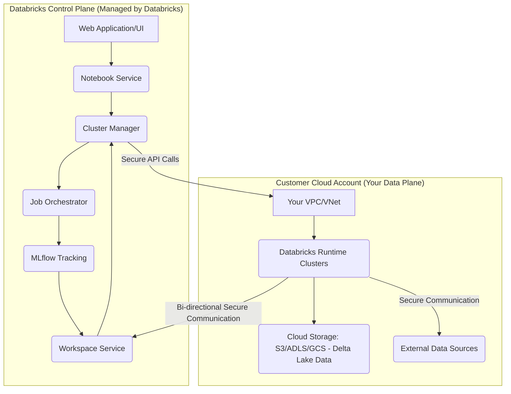

+++
title = "Demystifying Databricks: An Architectural Deep-Dive into Compute, Delta, and Photon"
date = "2026-05-17"
tags = ["databricks"]
categories = ["Data Engineering"]
banner = "img/banners/2026-05-17-demystifying-databricks-an-architectural-deep-dive-into-compute-delta-and-photon.jpg"
+++

# Demystifying Databricks: An Architectural Deep-Dive into Compute, Delta, and Photon

The modern data landscape demands agility, scalability, and unified governance. While many platforms promise these, Databricks stands out with its Lakehouse architecture, built upon Apache Spark and Delta Lake. But what truly makes it tick? Beyond the notebooks and pretty dashboards lies a sophisticated orchestration of compute, storage, and metadata management. This deep-dive will pull back the curtain, exploring the "under-the-hood" mechanisms that empower Databricks to deliver on its promise.

## Databricks' Core Architecture: The Control Plane and Data Plane

At its heart, Databricks operates on a dual-plane architecture: the **Control Plane** and the **Data Plane**. Understanding this separation is crucial for grasping its security, scalability, and operational model.

### 1. The Control Plane (Managed by Databricks)
The Control Plane is a multi-tenant environment hosted and managed entirely by Databricks. It's the brain of the operation, responsible for:
*   **Notebooks & Web Application:** The interactive UI, job scheduler, and workspace management.
*   **Cluster Management:** Provisioning, configuration, termination, and monitoring of compute resources in your Data Plane.
*   **Job Orchestration:** Scheduling and execution of data pipelines.
*   **Security:** Authentication (OAuth, SCIM), authorization (ACLs), audit logs.
*   **Metadata Services:** Storing cluster configurations, job definitions, and Delta Lake transaction logs (indirectly, via commands relayed to the Data Plane).
*   **Git Integration:** Managing code repositories.

### 2. The Data Plane (Your Cloud Account)
The Data Plane is where your actual data processing happens. It resides within your own cloud account (AWS, Azure, GCP), providing strong data isolation and control.
*   **Compute Resources:** Spark clusters (VMs, containers) provisioned by Databricks in your VPC/VNet.
*   **Data Storage:** Your cloud storage (S3, ADLS Gen2, GCS) where Delta Lake tables and other data assets reside.
*   **Network Connectivity:** All data traffic, cluster-to-storage communication, and inter-cluster communication occurs within your cloud environment.

The two planes communicate securely over a managed connection. Your data never leaves your cloud account to reach the Control Plane.



## The Engine Under the Hood: Apache Spark & Photon

At its core, Databricks leverages Apache Spark for distributed data processing. However, to push performance boundaries, Databricks introduced **Photon**, a vectorized query engine.

### Apache Spark's Role
Spark provides the fundamental distributed processing capabilities:
*   **Distributed Processing:** Breaking down large datasets and computations across multiple nodes.
*   **In-Memory Caching:** Speeding up iterative algorithms.
*   **Fault Tolerance:** Resilient Distributed Datasets (RDDs) ensure operations can recover from node failures.
*   **Unified API:** Supporting SQL, Python, Scala, R, Java.

### Photon: The Next-Gen Vectorized Query Engine
Photon is a native, C++ implemented vectorized query engine that is fully compatible with Apache Spark APIs. It aims to accelerate data workloads, especially SQL and DataFrame operations.

**How Photon Achieves Performance Gains:**

1.  **Vectorized Query Processing:** Instead of processing data row-by-row, Photon processes data in batches (vectors). This significantly reduces CPU overhead by allowing instructions to operate on multiple data points simultaneously, leveraging CPU SIMD (Single Instruction, Multiple Data) instructions.
2.  **JIT Compilation:** Photon dynamically compiles parts of the query plan into machine code at runtime. This "just-in-time" compilation optimizes execution paths for specific data types and operations, eliminating interpreter overhead.
3.  **Data Skipping & Predicate Pushdown:** By deeply integrating with Delta Lake's metadata (min/max stats, null counts), Photon can skip irrelevant data files entirely based on query predicates, drastically reducing I/O.
4.  **Optimized Shuffling & Join Strategies:** Enhancements in how data is exchanged between nodes and how join operations are performed contribute to faster execution.
5.  **Native Implementation:** Written in C++, Photon avoids the overheads associated with JVM-based execution for critical data path operations.

**When is Photon Used?**
Photon automatically accelerates SQL and DataFrame operations on Databricks clusters running Photon-enabled runtimes. It seamlessly integrates, so you don't need to rewrite your code.

## Delta Lake: The Foundation of the Lakehouse

Delta Lake is an open-source storage layer that brings ACID transactions to Spark and large-scale data lakes. It's the cornerstone of the Databricks Lakehouse architecture.

### 1. ACID Transactions & The Transaction Log
Delta Lake achieves ACID (Atomicity, Consistency, Isolation, Durability) properties by maintaining a **transaction log** (also known as the Delta Log or Delta Transaction Log). This log is stored alongside your data in the `_delta_log` directory.

Each transaction (write, update, delete, merge) on a Delta table is recorded as a new JSON commit file in this log. These files contain:
*   **Actions:** Add/remove data files, schema changes, table properties.
*   **Version Number:** Each commit increments the version.
*   **Timestamp:** When the commit occurred.
*   **Operation Metrics:** Details about the operation (rows affected, files added/removed).

This log acts as a single source of truth, ensuring atomicity (all or nothing), consistency (valid state transitions), and isolation (readers see a consistent snapshot). Durability comes from storing both the log and data in highly durable cloud storage.

**Example: Inside the `_delta_log` directory**

```json
// Example of a commit file (00000000000000000000.json)
{
  "commitInfo": {
    "timestamp": 1678886400000,
    "operation": "WRITE",
    "operationParameters": {
      "mode": "Append",
      "partitionBy": "[]"
    },
    "isBlindAppend": true,
    "operationMetrics": {
      "numFiles": "1",
      "numOutputRows": "1000",
      "numOutputBytes": "123456"
    }
  },
  "add": {
    "path": "part-00000-00000000-abcd-1234-abcd-123456789012-c000.snappy.parquet",
    "size": 123456,
    "modificationTime": 1678886390000,
    "dataChange": true
  }
}
```

The sequence of these JSON files defines the entire history of the table. Checkpoint files (Parquet format) are periodically created to optimize reading the log by consolidating multiple JSON commit files into a single, efficient snapshot.

### 2. Data Layout & Optimization

Delta Lake stores data as Parquet files, a highly efficient columnar format. To optimize query performance, Delta Lake provides several features:

#### a. Z-Ordering (Co-locality of related information)
Z-Ordering is a technique to co-locate related information in the same set of files. It's particularly effective for queries with multiple filters or joins on frequently used columns. When you `ZORDER BY` columns, Delta Lake attempts to pack data with similar values for those columns into common Parquet files. This minimizes the amount of data that needs to be read from storage.

**Syntax:**

```sql
OPTIMIZE default.my_delta_table
ZORDER BY (columnA, columnB);
```

**Under the Hood:**
The `OPTIMIZE` command with Z-Ordering rewrites data files. It reads existing files, sorts and groups data based on the Z-Order curve for the specified columns, and writes new, optimized Parquet files. Old files are marked for deletion in the transaction log and eventually removed by `VACUUM`.

#### b. Liquid Clustering (Evolution of Z-Ordering)
Liquid Clustering is a newer, more flexible alternative to Z-Ordering, especially beneficial for tables with evolving access patterns or high cardinality columns. Instead of a fixed Z-Order, Liquid Clustering dynamically adapts to query patterns.

**Key Benefits:**
*   **Flexibility:** You can cluster by different columns over time without rewriting the entire table schema.
*   **Automatic Optimization:** The `OPTIMIZE` command with Liquid Clustering can automatically re-cluster data based on current data distribution and query access.
*   **Granular Control:** When you query, Databricks automatically uses the clustering metadata to prune files.

**Defining Liquid Clustering (at table creation):**

```sql
CREATE TABLE default.my_liquid_table (
  id INT,
  event_time TIMESTAMP,
  value STRING
) USING DELTA
CLUSTER BY (event_time, id);
```

**Changing Cluster Keys (runtime adaptation):**

```sql
ALTER TABLE default.my_liquid_table
CLUSTER BY (value); -- Change to cluster by 'value' column
```

**Running Optimization:**

```sql
OPTIMIZE default.my_liquid_table; -- Re-clusters based on current CLUSTER BY definition
```

#### c. Schema Evolution & Enforcement
Delta Lake allows you to evolve your table schema safely.
*   **Schema Enforcement:** By default, Delta Lake prevents writes that don't match the table's schema. This prevents data corruption.
*   **Schema Evolution:** You can explicitly allow schema changes (e.g., adding new columns) using the `mergeSchema` option or `ALTER TABLE`.

**Example: Appending data with a new column**

```python
from pyspark.sql import SparkSession
from pyspark.sql.functions import lit

spark = SparkSession.builder.appName("DeltaSchemaEvolution").getOrCreate()

# Create initial table
spark.range(0, 5).withColumn("value", lit("old")).write.format("delta").mode("overwrite").save("/delta/my_table")

# Append data with a new column, allowing schema merge
new_data = spark.range(5, 10).withColumn("value", lit("new")).withColumn("category", lit("A"))
new_data.write.format("delta").mode("append").option("mergeSchema", "true").save("/delta/my_table")

# Read and show the evolved schema
spark.read.format("delta").load("/delta/my_table").printSchema()
```

#### d. Time Travel (Data Versioning)
Thanks to the transaction log, Delta Lake maintains a full history of all changes, enabling "Time Travel." You can query older versions of your data.

**Use Cases:**
*   Auditing and compliance.
*   Reproducing experiments.
*   Rolling back erroneous writes.

**Syntax:**

```sql
-- Query data as it was at a specific version
SELECT * FROM default.my_delta_table VERSION AS OF 5;

-- Query data as it was at a specific timestamp
SELECT * FROM default.my_delta_table TIMESTAMP AS OF '2023-01-01 12:00:00';

-- Restore a table to an earlier version
RESTORE TABLE default.my_delta_table TO VERSION AS OF 3;
```

## Databricks Compute: Beyond the Basics

Databricks offers different cluster types tailored for specific workloads and cost efficiencies.

### 1. Cluster Types: All-Purpose vs. Job Clusters

| Feature            | All-Purpose Cluster (Interactive)                 | Job Cluster (Automated)                                |
| :----------------- | :------------------------------------------------ | :----------------------------------------------------- |
| **Purpose**        | Ad-hoc analytics, interactive development, exploration | Automated jobs, ETL pipelines, recurring tasks         |
| **Lifecycle**      | Manual start/stop, auto-termination               | Automatically launched for each job, terminated after  |
| **Cost**           | Higher DBU cost per hour                          | Lower DBU cost per hour (cost-optimized)               |
| **Sharing**        | Can be shared by multiple users                   | Dedicated to a single job execution                    |
| **Configuration**  | Flexible, manual setup                            | Programmatic via API, UI, or workflows                 |
| **Pricing Model**  | Interactive DBUs                                  | Automated DBUs                                         |

**Choosing the Right Cluster:**
*   For development, debugging, and interactive data science, use **All-Purpose**.
*   For production ETL, batch processing, and scheduled tasks, always use **Job Clusters** for cost savings and reliability.

### 2. Autoscaling & Autotermination

*   **Autoscaling:** Databricks clusters can automatically scale up or down based on workload demand. You define a minimum and maximum number of worker nodes.
    *   **Scale Up:** When tasks queue up or existing nodes become overloaded.
    *   **Scale Down:** When nodes become idle for a configurable period.
*   **Autotermination:** Interactive clusters can be configured to automatically terminate after a period of inactivity (e.g., 30 minutes). This is a crucial cost-saving feature.

**Configuration Example (Databricks CLI - `create-cluster` payload):**

```json
{
  "cluster_name": "my-autoscaling-cluster",
  "spark_version": "12.2.x-scala2.12",
  "node_type_id": "i3.xlarge",
  "autoscale": {
    "min_workers": 2,
    "max_workers": 10
  },
  "autotermination_minutes": 30,
  "spark_conf": {
    "spark.databricks.delta.preview.enabled": "true"
  },
  "aws_attributes": {
    "zone_id": "auto",
    "first_on_demand": 1,
    "availability": "SPOT_WITH_FALLBACK",
    "instance_profile_arn": "arn:aws:iam::123456789012:instance-profile/my-databricks-profile"
  }
}
```

### 3. Databricks Connect: Local Dev, Remote Execution

Databricks Connect allows you to connect your IDE (PyCharm, VS Code, IntelliJ) or custom applications to Databricks clusters and execute Apache Spark code. Your code runs locally, but all Spark commands are sent to the remote Databricks cluster for execution, and results are sent back.

**Benefits:**
*   **Local Development Experience:** Use familiar IDE features (auto-completion, debugging).
*   **Centralized Compute:** Leverage the powerful Databricks clusters without moving data locally.
*   **Security:** Data remains in your cloud account.

**Setup Walkthrough (Python Example):**

1.  **Install Databricks Connect Client:**
    ```bash
pip install "databricks-connect==<DATABRICKS_RUNTIME_VERSION>"
# Example: pip install "databricks-connect==12.2.*"
    ```
    *Ensure the client version matches your cluster's Databricks Runtime version.*

2.  **Configure Databricks Connect (interactive):**
    ```bash
databricks-connect configure
# Follow prompts for Databricks Host, Token, Cluster ID, Org ID.
    ```
    Alternatively, set environment variables:
    `DATABRICKS_HOST`, `DATABRICKS_TOKEN`, `DATABRICKS_CLUSTER_ID`, `DATABRICKS_ORG_ID`.

3.  **Python Code Example:**

    ```python
from databricks.connect import DatabricksSession
from pyspark.sql.functions import col

# Initialize DatabricksSession. This automatically picks up configuration
# from environment variables or .databricks-connect file.
spark = DatabricksSession.builder.getOrCreate()

print("Databricks Runtime version:", spark.version)

# Example: Create a DataFrame and perform a Spark operation
df = spark.createDataFrame([(1, "apple"), (2, "banana"), (3, "cherry")], ["id", "fruit"])
result_df = df.filter(col("id") > 1).select("fruit")

# This 'show' operation executes on the remote Databricks cluster
result_df.show()

# Further operations, e.g., writing to Delta Lake
# result_df.write.format("delta").mode("overwrite").save("/mnt/my_delta_path")

spark.stop()
    ```

## Advanced Topics & Best Practices

### 1. Unity Catalog: The Governance Layer
While not "under-the-hood" in the sense of Spark or Delta Lake internals, Unity Catalog is a critical architectural component for modern data governance on Databricks. It provides a single, unified solution for:
*   **Centralized Metadata:** Managing data, AI assets, users, groups, and permissions across all workspaces and clouds.
*   **Fine-grained Access Control:** Table, column, and row-level security.
*   **Data Lineage:** Tracking how data transforms across pipelines.
*   **Audit Logging:** Comprehensive logs for compliance.

Unity Catalog enforces security and governance policies centrally, abstracting away the underlying cloud storage details and providing a consistent SQL interface for managing access.

### 2. CI/CD for Databricks Workloads

For robust data pipelines, adopting CI/CD practices is essential.

#### a. Databricks Repos
Databricks Repos provide Git integration directly within Databricks workspaces. This allows developers to:
*   **Version Control:** Commit, push, pull changes to Git providers (GitHub, GitLab, Azure DevOps, Bitbucket).
*   **Collaboration:** Work on branches, review code, merge changes.
*   **Deployment:** Use CI/CD pipelines to deploy notebooks and code from Repos to different environments (Dev, QA, Prod).

#### b. Automated Deployments with Databricks CLI/API
CI/CD tools (e.g., GitHub Actions, Azure DevOps Pipelines, Jenkins) can interact with the Databricks API or CLI to:
*   **Upload notebooks/scripts:** To specific workspace paths.
*   **Create/Update jobs:** Define job configurations using JSON or YAML and update them.
*   **Trigger jobs:** Execute data pipelines programmatically.
*   **Manage Clusters:** Create temporary job clusters for testing.

**Example: GitHub Actions for deploying a Databricks Job**

```yaml
name: Deploy Databricks Job

on:
  push:
    branches:
      - main
    paths:
      - 'databricks_jobs/**'

jobs:
  deploy:
    runs-on: ubuntu-latest
    steps:
      - name: Checkout repository
        uses: actions/checkout@v3

      - name: Install Databricks CLI
        run: pip install databricks-cli

      - name: Configure Databricks CLI
        run: |
          databricks configure --host ${{ secrets.DATABRICKS_HOST }} --token ${{ secrets.DATABRICKS_TOKEN }}

      - name: Deploy Databricks Notebook and Update Job
        run: |
          # Example: Upload a notebook to Databricks Workspace
          databricks workspace import --overwrite \
            ./databricks_jobs/my_notebook.py \
            /Users/my.email@example.com/my_notebook.py

          # Example: Update a Databricks Job definition
          # Assuming you have a job_config.json defining the job
          databricks jobs update --json-file ./databricks_jobs/job_config.json
```

**`databricks_jobs/job_config.json` example:**

```json
{
  "job_id": 12345,
  "new_settings": {
    "name": "My ETL Pipeline",
    "tasks": [
      {
        "task_key": "ProcessData",
        "notebook_task": {
          "notebook_path": "/Users/my.email@example.com/my_notebook.py",
          "base_parameters": {}
        },
        "new_cluster": {
          "spark_version": "12.2.x-scala2.12",
          "node_type_id": "i3.xlarge",
          "num_workers": 2,
          "spark_env_vars": {
            "PYSPARK_PYTHON": "/usr/bin/python3"
          }
        },
        "timeout_seconds": 3600,
        "max_retries": 1
      }
    ]
  }
}
```

### 3. Performance Tuning & Cost Optimization Challenges

*   **Small Files Problem:** Frequent micro-batches or many small appends to Delta Lake can lead to an accumulation of many small Parquet files. This degrades query performance due to increased metadata overhead and I/O seeks.
    *   **Solution:** Use `OPTIMIZE` regularly to compact files. Databricks' `auto_optimize` feature (enabled by default on newer runtimes for certain operations) also helps by automatically compacting small files during writes.
*   **Data Skew:** Uneven distribution of data values can cause some Spark tasks to take much longer than others, leading to bottlenecks.
    *   **Solution:** Re-partition data, use salting for joins, or re-evaluate join keys.
*   **Over-provisioning Clusters:** Running large clusters for light workloads wastes money.
    *   **Solution:** Leverage autoscaling, autotermination, and choose appropriate instance types for your workload's memory and CPU requirements. Use Job Clusters for production.
*   **Inefficient Delta Table Design:** Not clustering or partitioning tables effectively for common query patterns.
    *   **Solution:** Use `ZORDER BY` or `CLUSTER BY` on frequently filtered/joined columns. Consider partitioning for very large tables where filters often narrow down to specific partitions.

## Conclusion

Databricks, at its core, is a sophisticated platform that skillfully integrates Apache Spark, Delta Lake, and a powerful control plane to deliver a robust Lakehouse architecture. From the performance boost of the Photon engine to the ACID guarantees and time-travel capabilities of Delta Lake, and the streamlined development experience with Databricks Connect and Repos, each component is engineered for scale, reliability, and efficiency.

By diving "under the hood," we've seen how the separation of control and data planes provides security and flexibility, how Delta Lake's transaction log underpins its data reliability, and how careful cluster configuration and CI/CD practices are paramount for production-grade data pipelines. Understanding these internals empowers data professionals to design, build, and optimize solutions that truly leverage the full potential of the Databricks platform.