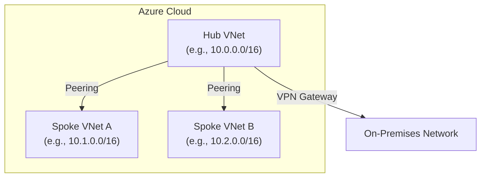
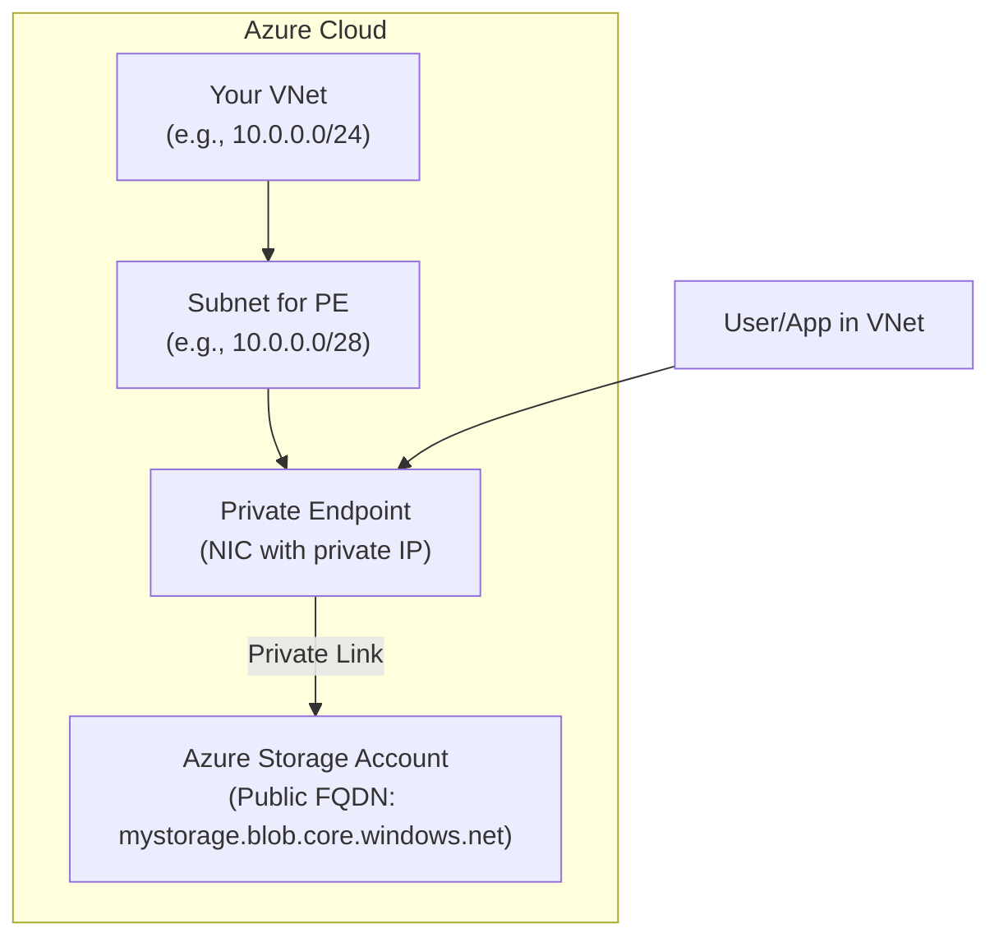

+++
title = "Demystifying Azure Networking: Beyond the Basics with VNet Peering and Private Endpoints"
date = "2026-05-31"
tags = ["azure-cloud"]
categories = ["cloud-networking"]
banner = "img/banners/2026-05-31-demystifying-azure-networking-beyond-the-basics-with-vnet-peering-and-private-endpoints.jpg"
+++

When diving deep into Azure, the networking layer is often where the real magic (and sometimes the biggest headaches) happens. While the basic Virtual Network (VNet) concept is straightforward, understanding how to securely and efficiently connect resources across VNets and to on-premises environments requires a solid grasp of advanced concepts like VNet Peering and Private Endpoints.

This post goes beyond the surface-level "drag and drop" of resources and explores the "under-the-hood" mechanics, architectural patterns, and practical implementation challenges you'll face when architecting robust Azure network solutions.

## The Anatomy of Azure VNet Connectivity

At its core, an Azure VNet is a logical representation of your on-premises network in the cloud. It's a broadcast domain, and all resources within a VNet can communicate with each other by default. However, real-world scenarios rarely involve a single, monolithic VNet. We often need to connect multiple VNets together or provide secure access to PaaS services without exposing them to the public internet.

### VNet Peering: The "Zero-Hop" Connection

VNet Peering is the cornerstone of inter-VNet communication within Azure. It allows you to connect two Azure VNets directly, enabling resources in each VNet to communicate with each other as if they were within the same network. Crucially, this connection happens over the Azure backbone network, effectively creating a "zero-hop" connection.

**Key Characteristics of VNet Peering:**

*   **Non-transitive:** If VNet A is peered with VNet B, and VNet B is peered with VNet C, VNet A and VNet C cannot communicate directly through VNet B. You'd need a separate peering between A and C.
*   **Global vs. Regional:** Peering can be established between VNets in the same Azure region (regional peering) or in different Azure regions (global peering).
*   **No IP Address Overlap:** VNets being peered must have non-overlapping address spaces. This is a critical constraint to remember during design.
*   **Traffic Flow:** Traffic between peered VNets uses the Microsoft backbone network, not public internet gateways. This ensures low latency and high bandwidth.

**Architectural Pattern: Hub-and-Spoke with VNet Peering**

A widely adopted pattern is the Hub-and-Spoke model. In this architecture:

*   **Hub VNet:** Centralized network services like firewalls, VPN gateways, and shared services (e.g., Domain Controllers) reside here. It often has connectivity to on-premises networks.
*   **Spoke VNets:** These VNets host individual workloads or applications. They are peered with the Hub VNet.

This pattern offers a centralized management and security model. All traffic from spokes destined for on-premises or the internet can be routed through the hub's security appliances.

**Diagram: Hub-and-Spoke VNet Peering**



**Configuration Example (Azure CLI for Peering):**

Let's assume we have two VNets, `vnet-hub` and `vnet-spoke-a`, and we want to peer them. First, ensure non-overlapping address spaces.

*   `vnet-hub`: Address Space `10.0.0.0/16`
*   `vnet-spoke-a`: Address Space `10.1.0.0/16`

```bash
# Set variables
RESOURCE_GROUP="rg-network"
VNET_HUB_NAME="vnet-hub"
VNET_SPOKE_A_NAME="vnet-spoke-a"
PEERING_HUB_TO_SPOKE_A="peering-hub-to-spoke-a"
PEERING_SPOKE_A_TO_HUB="peering-spoke-a-to-hub"

# Create peering from Hub to Spoke A
az network vnet peering create \
  --resource-group $RESOURCE_GROUP \
  --vnet-name $VNET_HUB_NAME \
  --name $PEERING_HUB_TO_SPOKE_A \
  --remote-vnet $VNET_SPOKE_A_NAME \
  --allow-vnet-access

# Create peering from Spoke A to Hub
az network vnet peering create \
  --resource-group $RESOURCE_GROUP \
  --vnet-name $VNET_SPOKE_A_NAME \
  --name $PEERING_SPOKE_A_TO_HUB \
  --remote-vnet $VNET_HUB_NAME \
  --allow-vnet-access

# Verify peering status (should be 'Connected')
az network vnet peering show \
  --resource-group $RESOURCE_GROUP \
  --vnet-name $VNET_HUB_NAME \
  --name $PEERING_HUB_TO_SPOKE_A \
  --query "provisioningState"

az network vnet peering show \
  --resource-group $RESOURCE_GROUP \
  --vnet-name $VNET_SPOKE_A_NAME \
  --name $PEERING_SPOKE_A_TO_HUB \
  --query "provisioningState"
```

**Challenge:** Managing a large number of spokes can lead to a "mesh" of peering connections. For example, if you have 50 spokes, and each needs to communicate with the hub, you'd have 50 peerings originating from the hub. While manageable, consider automation for larger deployments.

**Advanced Configuration: Gateway Transit**

In a Hub-and-Spoke model, if you want spokes to access on-premises resources via the hub's VPN Gateway, you need to enable `GatewayTransit` on the spoke-to-hub peering and `AllowGatewayTransit` on the hub-to-spoke peering. This tells the spokes that their gateway is located in the hub VNet.

```bash
# Enable Gateway Transit on Spoke A peering to Hub
az network vnet peering update \
  --resource-group $RESOURCE_GROUP \
  --vnet-name $VNET_SPOKE_A_NAME \
  --name $PEERING_SPOKE_A_TO_HUB \
  --allow-gateway-transit

# Enable Allow Gateway Transit on Hub peering to Spoke A
az network vnet peering update \
  --resource-group $RESOURCE_GROUP \
  --vnet-name $VNET_HUB_NAME \
  --name $PEERING_HUB_TO_SPOKE_A \
  --allow-virtual-wan-access  # Note: This parameter is used for VNet peering with Azure Virtual WAN, adjust if using a plain VNet Gateway
  # --allow-transit-gateway # This is for Transit Gateway, not VNet Peering directly. Recheck parameters based on specific gateway service.
```

*Self-Correction Note:* The `allow-virtual-wan-access` parameter in the CLI is relevant when peering with Azure Virtual WAN. For traditional VNet Gateways, the `allow-gateway-transit` flag is applied on the spoke-to-hub peering, and the hub VNet peering needs to have `use-hub-vnet-gateways: true` (this is often implicitly handled by the peering configuration when the hub has a gateway and transit is enabled). It's crucial to consult the latest Azure CLI documentation for precise parameter names and their implications.

## Private Endpoints: Secure Access to PaaS Services

Connecting to Azure PaaS services like Azure SQL Database, Storage Accounts, or Key Vault often involves exposing them to a public endpoint. This is where Private Endpoints come into play. A Private Endpoint is a network interface that connects you privately to a service, leveraging a private IP address from your VNet.

**How it Works:**

Instead of accessing a PaaS service via its public FQDN (e.g., `mystorageaccount.blob.core.windows.net`), a Private Endpoint assigns a private IP address from your VNet to a new private FQDN (e.g., `privatelink.blob.core.windows.net`). This effectively brings the PaaS service *into* your VNet privately.

**Diagram: Private Endpoint for Azure Storage**



**Benefits:**

*   **Enhanced Security:** Data travels over the Microsoft backbone network, not the public internet.
*   **Simplified Network Security:** You can block all public access to your PaaS services, relying solely on Private Endpoints.
*   **Private FQDN:** Uses a DNS record (`privatelink.service.core.windows.net`) that resolves to the private IP address.

**Implementation Challenges:**

1.  **DNS Resolution:** This is the most common hurdle. When you create a Private Endpoint, it often comes with a default private FQDN. To ensure correct resolution from your VNet (and potentially on-premises via hybrid connectivity), you need to configure your DNS to map the service's public FQDN to the Private Endpoint's IP address. This can be done using Azure Private DNS Zones.

    **Table: DNS Configuration Options**
    | Option             | Description                                                                                                                                                                    |
    |--------------------|--------------------------------------------------------------------------------------------------------------------------------------------------------------------------------|
    | **Azure Private DNS Zone** | Recommended approach. Create a Private DNS Zone (e.g., `privatelink.blob.core.windows.net`) and link it to your VNet. It will automatically create an A record for the Private Endpoint. |
    | **Custom DNS Server** | If you use your own DNS servers (e.g., Windows Server on an Azure VM), you'll need to create conditional forwarders or A records pointing to the Private Endpoint's IP.            |
    | **Hosts File**     | **Not recommended for production.** Useful for quick testing, but brittle and unmanageable at scale.                                                                             |

    **Example: Azure CLI for Private DNS Zone Creation and Linking**

    Let's say we created a Private Endpoint for a Storage Account, and its private FQDN is `mystorageaccount.privatelink.blob.core.windows.net`.

    ```bash
    # Variables
    RESOURCE_GROUP="rg-network"
VNET_NAME="my-vnet"
    PRIVATE_DNS_ZONE_NAME="privatelink.blob.core.windows.net"
    STORAGE_ACCOUNT_NAME="mystorageaccount"
    PRIVATE_ENDPOINT_NAME="pe-storage"

    # Create a Private DNS Zone
    az network private-dns zone create \
      --resource-group $RESOURCE_GROUP \
      --name $PRIVATE_DNS_ZONE_NAME

    # Link the Private DNS Zone to the VNet
    az network private-dns link vnet create \
      --resource-group $RESOURCE_GROUP \
      --name "vnet-link-to-dns"
      --zone-name $PRIVATE_DNS_ZONE_NAME \
      --target-vnet $VNET_NAME \
      --registration-enabled false # Set to true if you want auto-registration of records from PE

    # Manually create an A record (if registration is false or for specific overrides)
    # First, get the Private Endpoint's IP address
    PRIVATE_ENDPOINT_IP=$(az network private-endpoint show \
      --resource-group $RESOURCE_GROUP \
      --name $PRIVATE_ENDPOINT_NAME \
      --query "networkInterfaces[0].ipConfigurations[0].privateIpAddress" \
      --output tsv)

    az network private-dns record-set a add-record \
      --resource-group $RESOURCE_GROUP \
      --zone-name $PRIVATE_DNS_ZONE_NAME \
      --record-set-name $STORAGE_ACCOUNT_NAME \
      --ipv4-address $PRIVATE_ENDPOINT_IP
    ```

2.  **Network Security Groups (NSGs):** NSGs applied to the subnet hosting the Private Endpoint's NIC will affect traffic *to* the Private Endpoint. However, NSGs on the VNet subnets *do not* directly filter traffic going *to* the Private Endpoint; that's handled by the service itself and the Private Link service's internal security. You still need NSGs for your compute resources within the VNet.

3.  **Service-Specific Access Policies:** While Private Endpoints secure the connection, you still need to configure access control on the PaaS service itself (e.g., IAM roles for Storage Accounts, firewall rules for Azure SQL). You should ideally restrict access to only the Private Endpoint's VNet or specific IPs from within that VNet.

**Challenge: Bridging On-Premises and Private Endpoints**

If your on-premises applications need to access PaaS services via Private Endpoints in Azure, you'll need a robust hybrid connectivity solution (e.g., Azure ExpressRoute or VPN Gateway) and proper DNS forwarding. On-premises DNS servers must forward queries for `privatelink.service.core.windows.net` to an Azure DNS resolver (like Azure DNS Private Resolver or a DNS server in Azure VNet), which can then resolve the Private Endpoint's IP.

## Conclusion

Mastering Azure networking is a continuous journey. VNet Peering and Private Endpoints are fundamental building blocks for creating secure, scalable, and efficient cloud architectures. By understanding their underlying mechanisms, common architectural patterns like Hub-and-Spoke, and the critical role of DNS, you can navigate implementation challenges and build robust solutions that leverage the full power of Azure's networking capabilities. Remember to always validate your configurations and leverage Azure's network monitoring tools to troubleshoot effectively.
