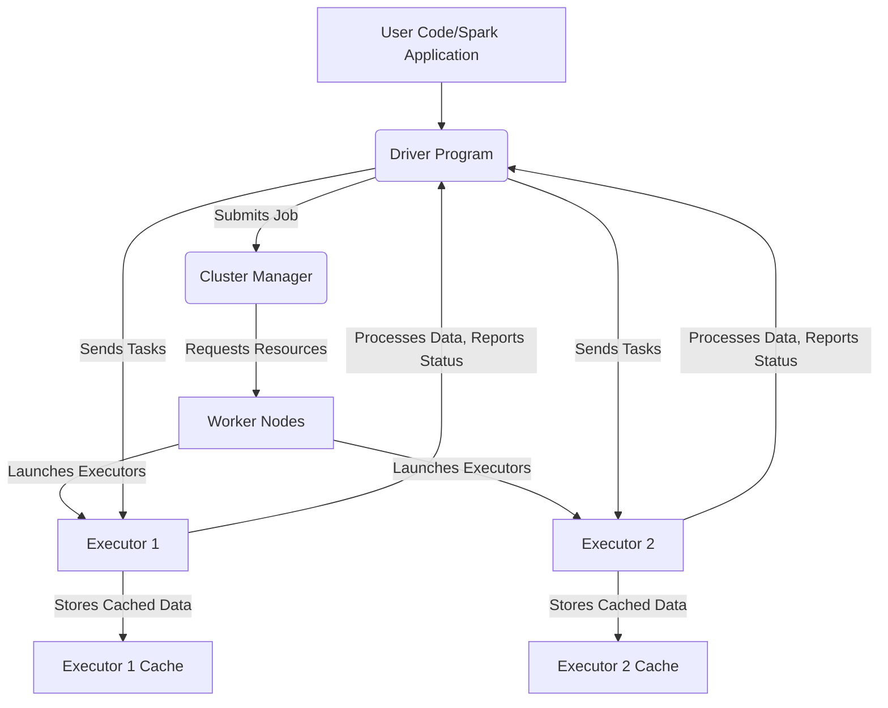

+++
title = "Spark Deep Dive: Unraveling the Magic of Catalyst, Tungsten, and Beyond"
date = "2026-06-24"
tags = ["spark","performance-tuning","big-data","architecture","catalyst","tungsten","shuffling"]
categories = ["technical-guides"]
banner = "img/banners/2026-06-24-spark-deep-dive-unraveling-the-magic-of-catalyst-tungsten-and-beyond.jpg"
+++

Apache Spark has become the de facto standard for big data processing, but many developers interact with it purely through its high-level APIs like DataFrames and Spark SQL without truly understanding the intricate machinery humming beneath. This post isn't another 'What is Spark?' introduction; instead, we'll peel back the layers to explore Spark's core architecture, optimization engines, and common performance challenges, arming you with the knowledge to troubleshoot and tune your Spark applications like a pro.

## Spark's Core Architecture: Beyond the Basics

At its heart, a Spark application consists of a **Driver** program and a set of **Executors**. While seemingly straightforward, their interaction orchestrates every data processing task.

*   **Driver Program:** This is where your `main()` method or `SparkSession` lives. It's responsible for:
    *   Creating the `SparkContext` (the entry point to Spark functionality).
    *   Analyzing, scheduling, and distributing work (tasks) to executors.
    *   Maintaining the Directed Acyclic Graph (DAG) of operations.
    *   Coordinating with the Cluster Manager (YARN, Mesos, Kubernetes, Standalone) to acquire resources.
*   **Executors:** These are worker processes running on nodes in the cluster. Each executor:
    *   Runs tasks in parallel on its allocated CPU cores.
    *   Stores cached data in memory.
    *   Reports task status and results back to the driver.

Think of the Driver as a master chef planning a complex meal, breaking it down into individual cooking steps, and assigning them to various kitchen hands (Executors) who perform the actual work (Tasks) on different ingredients (data partitions).


_Figure 1: Simplified Spark Job Execution Flow_

## The Evolution: From RDDs to DataFrames/Datasets

While Resilient Distributed Datasets (RDDs) are the foundational building blocks of Spark, the introduction of DataFrames and Datasets marked a significant leap forward in terms of performance and usability.

| Feature           | RDDs                                     | DataFrames & Datasets                            |
| :---------------- | :--------------------------------------- | :----------------------------------------------- |
| **Data Structure**| Unstructured/Semi-structured collections | Structured, schema-aware, columnar               |
| **Type Safety**   | Runtime errors                           | Compile-time (Datasets) or Runtime (DataFrames)  |
| **Optimization**  | No built-in optimizer; manual tuning     | Catalyst Optimizer; Tungsten Engine              |
| **API**           | Low-level, functional transformations    | High-level, declarative, SQL-like                |
| **Serialization** | Java/Kryo by default                     | Specialized internal Tungsten format             |
| **Performance**   | Generally slower for structured data     | Significantly faster due to optimizations        |

DataFrames and Datasets leverage Spark's optimization engine, **Catalyst**, to generate highly efficient execution plans. When you write a Spark SQL query or DataFrame operation, you're not just executing code; you're providing a logical description of *what* you want to achieve, and Catalyst figures out the most optimal *how*.

## The Brain of Spark: Catalyst Optimizer

The Catalyst Optimizer is arguably Spark's most crucial innovation for performance. It's an extensible query optimizer that allows Spark to generate highly optimized physical plans for structured data processing. It works in several phases:

1.  **Parsing & Analysis:** Your SQL query or DataFrame operations are parsed into an **Unresolved Logical Plan**. This plan is then resolved by looking up tables, columns, and functions in the SparkSession's catalog, creating a **Resolved Logical Plan**.

    ```scala
    // Example: A simple DataFrame operation
    val df = spark.read.json("data.json")
      .filter($"age" > 30)
      .groupBy($"city").count()

    df.explain(true) // 'true' for extended output
    ```

2.  **Logical Optimization:** Catalyst applies rule-based optimizations (e.g., predicate pushdown, column pruning, constant folding, combining filters) to the resolved logical plan, resulting in an **Optimized Logical Plan**. This phase improves efficiency without considering the physical execution environment.

    *   **Predicate Pushdown:** Filters are moved as close to the data source as possible, reducing the amount of data read.
    *   **Column Pruning:** Only necessary columns are read, reducing I/O and memory footprint.

3.  **Physical Planning:** Based on the optimized logical plan, Catalyst generates multiple **Physical Plans**. These plans consider the cluster's capabilities and data characteristics (e.g., data size, partitioning) to choose the most efficient join strategy (broadcast join vs. sort-merge join) or aggregation method (hash aggregation vs. sort aggregation).

4.  **Cost-Based Optimization (CBO):** Spark can optionally use statistics (e.g., table size, distinct values, null counts) to estimate the cost of different physical plans and select the cheapest one. This is crucial for complex queries.

    ```sql
    -- Example of collecting statistics for CBO
    ANALYZE TABLE my_table COMPUTE STATISTICS FOR COLUMNS col1, col2;
    ```

5.  **Code Generation (Tungsten):** The chosen physical plan is then compiled into highly optimized Java bytecode using a technique called Whole-Stage Code Generation (WSCG), part of the **Tungsten** project.

Let's trace a simple `df.explain()` output:

```text
== Physical Plan ==
AdaptiveSparkPlan isFinalPlan=false
+- HashAggregate(keys=[city#1], functions=[count(1)], output=[city#1, count#2L])
   +- Exchange hashpartitioning(city#1, 200), ENSURE_REQUIREMENTS, [id=#5]
      +- HashAggregate(keys=[city#1], functions=[partial_count(1)], output=[city#1, partial_count#3L])
         +- Project [city#1]
            +- Filter (isnotnull(age#0) AND (age#0 > 30))
               +- Scan JSON data.json
```

In this output, you can observe:
*   `Scan JSON data.json`: Data is read.
*   `Filter (isnotnull(age#0) AND (age#0 > 30))`: Predicate pushdown applied.
*   `Project [city#1]`: Column pruning (only `city` is needed for `groupBy` after filtering).
*   `HashAggregate` & `Exchange`: These indicate shuffle operations for `groupBy().count()`, which we'll discuss next.

## Tungsten: Bridging the JVM Gap

While Catalyst optimizes *what* to do, **Project Tungsten** optimizes *how* it's done, specifically targeting CPU and memory efficiency. The JVM, while powerful, introduces overheads like object headers, pointers, and frequent garbage collection (GC) pauses when dealing with billions of small objects (like rows in an RDD).

Tungsten addresses these challenges through:

1.  **Off-Heap Memory Management:** Spark directly manages memory outside the JVM heap using `sun.misc.Unsafe` or `java.nio.ByteBuffer`. This eliminates JVM object overhead and reduces GC pressure. Data is stored in a compact binary format (`UnsafeRow`) directly in this off-heap memory.
2.  **Whole-Stage Code Generation (WSCG):** Catalyst generates highly optimized bytecode for entire query stages. Instead of interpreting each operation (e.g., filter, map, join) one by one using generic functions, WSCG compiles a single function that performs all operations for a given pipeline, eliminating virtual function calls and leveraging CPU caches more effectively.

    ```java
    // Conceptual idea of WSCG (not actual Spark code)
    // Instead of: filter(row1); map(row1); filter(row2); map(row2);
    // WSCG generates something like:
    for (Row r : partition) {
        if (filterCondition(r)) {
            processAndMap(r);
        }
    }
    ```
    This effectively flattens the execution pipeline, making it much faster.

3.  **Cache-Aware Computation:** Tungsten designs algorithms to leverage CPU caches, processing data in batches that fit within L1/L2 caches to minimize memory access latency.

## The Cost of Distribution: Shuffling

Shuffling is one of the most expensive operations in Spark. It involves redistributing data across partitions, often moving data across the network between executors. Operations that trigger a shuffle include:

*   `groupByKey`, `reduceByKey`, `aggregateByKey`
*   `join` (unless it's a broadcast join)
*   `distinct`
*   `repartition`
*   `orderBy`, `sort`

**Why is Shuffle Expensive?**

*   **Network I/O:** Moving data between nodes is slow compared to in-memory operations.
*   **Disk I/O:** Intermediate shuffle files are often written to local disks by shuffle writers and then read by shuffle readers. This can be a bottleneck.
*   **Serialization/Deserialization:** Data needs to be serialized before sending over the network and deserialized upon arrival. This consumes CPU cycles.
*   **Memory Pressure:** Shuffle buffers can consume significant executor memory, potentially leading to OOM errors or frequent spilling to disk.

**Tuning Shuffle Behavior:**

*   `spark.sql.shuffle.partitions`: Controls the number of partitions for shuffles. Default is 200. Setting this too high can create too many small tasks; too low can lead to data skew and OOMs.

    ```python
    # Example: Setting shuffle partitions via SparkSession config
    spark = SparkSession.builder \
        .appName("ShuffleTuning") \
        .config("spark.sql.shuffle.partitions", 500) \
        .getOrCreate()
    ```

*   `spark.shuffle.service.enabled`: When true (recommended for most clusters), executors register with an external shuffle service that persists shuffle files. This allows executors to be gracefully decommissioned without losing shuffle data, making Spark more resilient.

*   `spark.shuffle.compress`: Compresses shuffle output files (default: true). Helps reduce network I/O but adds CPU overhead.

## Practical Performance Tuning Deep Dive

Understanding Spark's internals is key to effective tuning. Here are common areas to optimize:

1.  **Memory Management (`spark.executor.memory`, `spark.memory.fraction`, etc.):**
    *   `spark.executor.memory`: Crucial. Allocate enough memory for tasks, cached data, and shuffle buffers. Too little leads to spills and OOMs; too much wastes resources or causes frequent, long GC pauses.
    *   `spark.memory.fraction`: (Default: 0.6) The fraction of `spark.executor.memory` used for RDD caching and execution (shuffle, join, aggregation buffers). Increasing this leaves less for user code and other JVM overheads.
    *   `spark.memory.storageFraction`: (Default: 0.5 of `spark.memory.fraction`) The fraction of the execution & storage memory region that is used for storage. A higher value prioritizes caching over execution buffers.

2.  **CPU & Parallelism (`spark.executor.cores`, `spark.default.parallelism`, `spark.sql.autoBroadcastJoinThreshold`):**
    *   `spark.executor.cores`: Number of cores per executor. Generally, 2-5 cores per executor is a good balance to avoid GC contention and utilize CPU efficiently. Too many cores can lead to too many threads per JVM, causing context switching overhead and GC issues.
    *   `spark.default.parallelism`: Number of partitions in RDDs returned by transformations like `reduceByKey`, `join`, `groupByKey`. For DataFrames, `spark.sql.shuffle.partitions` is more relevant for shuffle operations.
    *   **Broadcast Joins:** If one side of a join is small (default threshold: 10MB, controlled by `spark.sql.autoBroadcastJoinThreshold`), Spark can broadcast it to all executors, avoiding a costly shuffle for the larger table. Set this value carefully; too large and you'll OOM executors.

    ```python
    # Example: Increase broadcast join threshold to 50MB
    spark.conf.set("spark.sql.autoBroadcastJoinThreshold", 50 * 1024 * 1024)
    
    # Force a broadcast join explicitly for a DataFrame
    from pyspark.sql.functions import broadcast
    joined_df = large_df.join(broadcast(small_df), "id")
    ```

3.  **Data Skew Handling:** When data is unevenly distributed across partitions, some tasks finish quickly while others (on partitions with much more data) become bottlenecks. This is data skew.
    *   **Identify:** Look for stages where most tasks complete quickly, but a few 'straggler' tasks take a very long time.
    *   **Mitigation:**
        *   **Salting:** Add a random prefix/suffix to the skewed join key on both sides of the join, then join on the salted key. This distributes the skewed key across multiple partitions. Afterward, remove the salt.
        *   **Filtering Skewed Keys:** If specific keys are highly skewed, process them separately and then union the results.
        *   **Custom Partitioner:** For RDDs, you can define a custom partitioner to distribute data more evenly.

    ```python
    # Conceptual example of salting a join key
    import random
    
def add_salt(key_value):
        return f"{key_value}_{random.randint(0, 9)}"

    df_skewed = spark.createDataFrame([(1, "A"), (1, "B"), (1, "C"), (2, "D")], ["id", "value"])
    df_small = spark.createDataFrame([(1, "X"), (2, "Y")], ["id", "other_value"])

    # Add salt to the skewed DataFrame
    df_salted = df_skewed.withColumn("salted_id", add_salt(df_skewed["id"]).cast("string"))

    # Prepare the smaller DataFrame for join (replicate keys with salts)
    # This part can be complex depending on the skew and data volume
    # For simplicity, let's assume `df_small` is small enough to be broadcast after transformation
    # or we need to generate salted versions for it too.
    # A more robust solution might involve identifying the skewed keys first.
    # Or, if `df_small` is truly small, broadcast it and avoid salting on that side.

    # For illustration, let's just show a repartition example for skew if not using broadcast
    # If 'id' 1 is heavily skewed, repartitioning by 'id' would still be skewed.
    # Salting effectively creates 'id_0', 'id_1', ..., 'id_9' for the skewed key.
    ```

4.  **Serialization (Kryo vs. Java):**
    *   Spark uses Java serialization by default, which is robust but often slow and verbose.
    *   **Kryo serialization** (`spark.serializer` -> `org.apache.spark.serializer.KryoSerializer`) is generally much faster and more compact. It requires registering custom classes.

    ```python
    # Example: Configure Kryo serializer
    spark = SparkSession.builder \
        .appName("KryoSerialization") \
        .config("spark.serializer", "org.apache.spark.serializer.KryoSerializer") \
        .config("spark.kryoserializer.buffer.max", "256m") \
        .getOrCreate()
    ```

5.  **Predicate Pushdown & Column Pruning (Catalyst's Magic):**
    *   These are often automatically applied by Catalyst when using DataFrames/Spark SQL. Always use these APIs over RDDs for structured data to leverage these optimizations.
    *   Ensure your data sources (Parquet, ORC, JDBC) support these operations. For example, filtering on a column that is part of a Parquet partition key is extremely efficient.

## Conclusion

Mastering Spark involves moving beyond simply writing code to understanding its underlying architecture and how its sophisticated optimization engines like Catalyst and Tungsten work their magic. By deeply understanding concepts like logical and physical plans, the true cost of shuffling, and the nuances of memory management, you gain the power to diagnose performance bottlenecks and craft highly efficient, scalable Spark applications. Keep experimenting with `df.explain()`, monitoring your Spark UI, and diving into the documentation to become a true Spark performance wizard.
