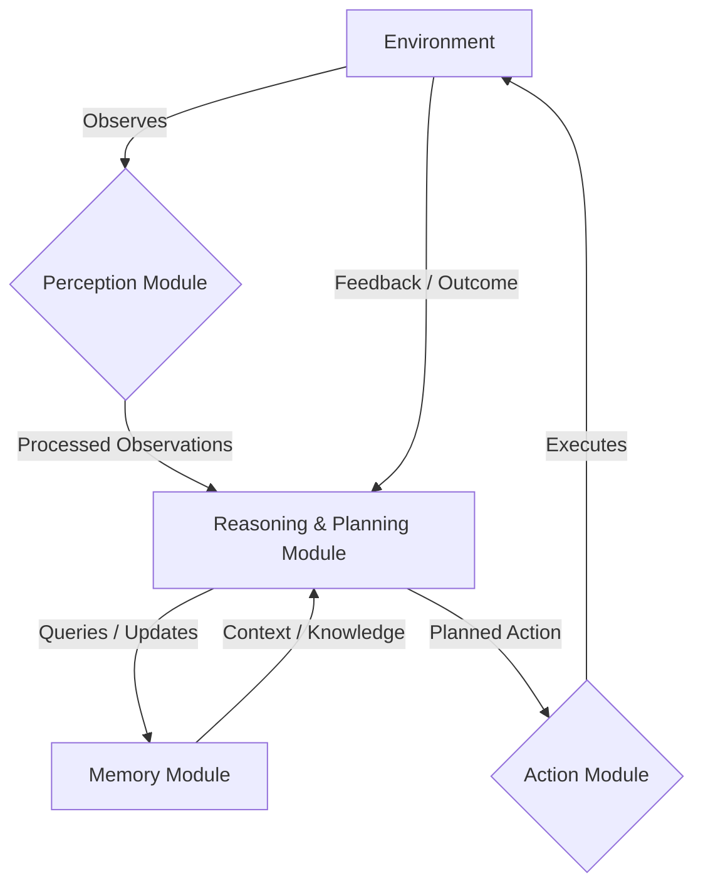

+++
title = "Under the Hood: Deconstructing AiAgent Architectures for Autonomous Systems"
date = "2026-07-26"
tags = ["AiAgent"]
categories = ["AI Engineering","Autonomous Systems"]
banner = "img/banners/2026-07-26-under-the-hood-deconstructing-aiagent-architectures-for-autonomous-systems.jpg"
+++

The proliferation of Large Language Models (LLMs) has ushered in a new era of intelligent automation, culminating in the rise of AiAgents. More than just wrappers around LLMs, AiAgents represent a paradigm shift towards autonomous, goal-oriented systems capable of perception, reasoning, action, and continuous learning within dynamic environments. This deep-dive post, tailored for the DataFibers Community, will peel back the layers, exploring the architectural patterns, "under-the-hood" mechanics, and practical implementation challenges of building robust AiAgents.

### The Anatomy of an AiAgent

At its heart, an AiAgent embodies a sophisticated control loop, often inspired by cognitive architectures. It's designed not just to respond, but to _act_ purposefully. Think of an AiAgent as having several interconnected modules:

1.  **Perception Module:** How the agent observes its environment. This can range from structured API responses to raw sensor data or document embeddings. It's the agent's 'eyes and ears.'
2.  **Memory Module:** Essential for context, learning, and statefulness. Divided into short-term (working memory) and long-term (knowledge base).
3.  **Reasoning & Planning Module:** The 'brain,' typically powered by an LLM. It interprets observations, retrieves relevant memories, forms a plan, and decides on the next action.
4.  **Action Module:** The agent's 'hands and voice.' This module executes planned actions, interacting with external tools, APIs, or even human users.
5.  **Feedback & Learning Loop:** A crucial component for self-correction and improvement. The agent evaluates the outcomes of its actions, updates its memory, and refines its future strategies.

Let's visualize this core loop:



### Memory: The Foundation of Intelligence

Effective memory management is paramount for an agent's long-term utility. We distinguish between:

| Memory Type   | Characteristics                                 | Use Cases                                    | Implementation Strategies                           |
| :------------ | :---------------------------------------------- | :------------------------------------------- | :---------------------------------------------------- |
| **Short-Term**| Ephemeral, contextual, high-bandwidth           | Current conversation, scratchpad for thoughts | LLM context window, simple list/dict, Redis           |
| **Long-Term** | Persistent, indexed, high-capacity, searchable | Knowledge base, past experiences, learned skills | Vector databases (ChromaDB, Pinecone, Qdrant), Relational DBs, Knowledge Graphs |

For long-term memory, vector databases are particularly powerful. They allow the agent to store and retrieve semantically similar pieces of information based on embeddings, enabling efficient RAG (Retrieval Augmented Generation).

### Tools: Extending Agent Capabilities

An agent's utility is directly proportional to the tools it can wield. These tools are essentially functions or APIs exposed to the LLM, often described via schema (e.g., JSON Schema). The LLM's 'function calling' capability is key here, allowing it to dynamically choose and execute tools based on its reasoning.

Consider a simple 'weather lookup' tool:

```python
import requests
import json

def get_current_weather(location: str) -> str:
    """
    Gets the current weather for a specified location.
    Args:
        location (str): The city and state, e.g., 'San Francisco, CA'.
    Returns:
        str: A JSON string with weather data or an error message.
    """
    try:
        # IMPORTANT: Replace 'YOUR_WEATHER_API_KEY' with a real API key 
        # In a production app, use environment variables (e.g., os.getenv('WEATHER_API_KEY'))
        api_key = "YOUR_WEATHER_API_KEY" 
        base_url = "http://api.openweathermap.org/data/2.5/weather"
        params = {"q": location, "appid": api_key, "units": "metric"}
        response = requests.get(base_url, params=params)
        response.raise_for_status() # Raise an exception for HTTP errors
        weather_data = response.json()
        return json.dumps(weather_data)
    except requests.exceptions.RequestException as e:
        return json.dumps({"error": f"Failed to fetch weather: {e}"})
    except json.JSONDecodeError:
        return json.dumps({"error": "Invalid JSON response from weather API."})

# Example of how an LLM might 'call' this tool conceptually
# tool_output = get_current_weather(location='London, UK')
# print(tool_output)
```

To make this accessible to an LLM, you'd typically provide a schema:

```json
{
  "name": "get_current_weather",
  "description": "Get the current weather in a given location",
  "parameters": {
    "type": "object",
    "properties": {
      "location": {
        "type": "string",
        "description": "The city and state, e.g., San Francisco, CA"
      }
    },
    "required": ["location"]
  }
}
```

### Reasoning & Orchestration: The Agent's Control Flow

The core of an agent's intelligence lies in its reasoning and planning module, often implemented as a specialized prompt for an LLM. The ReAct (Reasoning and Acting) pattern is a popular approach:

`Thought`: What should I do next? I need to...
`Action`: tool_name(tool_parameters)
`Observation`: Tool output
`Thought`: Based on the observation, I will...
`Action`: next_tool(next_parameters)
...
`Thought`: I have completed my task.
`Final Answer`: The answer is...

Here's a simplified pseudo-code representation of an agent's main loop:

```python
from typing import Dict, Any, Callable
import json

class SimpleAiAgent:
    def __init__(self, llm_client: Any, tools: Dict[str, Callable], memory_store: Any):
        self.llm = llm_client
        self.tools = tools
        self.memory = memory_store # e.g., a vector database client
        self.context = [] # Short-term context / conversation history

    def _get_relevant_memory(self, query: str, top_k: int = 3) -> list:
        # In a real implementation, this would query a vector DB
        # For simplicity, returning a dummy list here.
        print(f"[Memory] Retrieving for: '{query}'")
        return [f"Fact about {query}: Example data."]

    def _call_llm(self, prompt: str) -> str:
        # Placeholder for LLM API call
        print(f"[LLM Call] Input: '{prompt[:100]}...'")
        
        # Simulate LLM response containing Thought, Action or Final Answer
        # This logic would be replaced by an actual LLM API call and parsing
        if "weather in London" in prompt.lower() and "get_current_weather" in self.tools:
            return "Thought: I need to use the get_current_weather tool to find the weather in London, UK.\nAction: get_current_weather({'location': 'London, UK'})"
        elif "Observation:" in prompt and "weather_data" in prompt.lower():
            return "Thought: I have the weather data. I can now provide the final answer.\nFinal Answer: The weather in London is currently 20 degrees Celsius and clear, according to the tool output."
        elif "final answer" in prompt.lower():
            # If the LLM already decided on a final answer, just return it
            return prompt 
        return "Thought: I am processing the request. I don't have enough information or a specific tool to directly answer this. If I had a 'search_web' tool, I would use it now.\nAction: None" # Fallback simulation

    def run(self, initial_query: str, max_iterations: int = 5) -> str:
        self.context.append(f"User query: {initial_query}")
        current_thought = f"Thought: I need to address the user's request: {initial_query}"

        for i in range(max_iterations):
            # 1. Perception & Memory Retrieval
            relevant_memories = self._get_relevant_memory(current_thought)
            full_prompt = (f"You are an expert AI agent. Current conversation context:\n{'\n'.join(self.context)}\n"
                           f"Relevant memories: {'\n'.join(relevant_memories)}\n"
                           f"Available tools: {list(self.tools.keys())}\n"
                           f"You must always respond with a 'Thought:' followed by 'Action: tool_name(args)' or 'Final Answer: your result'.\n"
                           f"{current_thought}\n")

            # 2. Reasoning (LLM Call)
            llm_response = self._call_llm(full_prompt)
            self.context.append(f"LLM Response: {llm_response}")

            if "Final Answer:" in llm_response:
                return llm_response.split("Final Answer:")[1].strip()

            if "Action:" in llm_response and "None" not in llm_response:
                action_str = llm_response.split("Action:")[1].strip()
                try:
                    # Robust parsing for tool name and arguments
                    tool_name_match = action_str.strip().split('(')[0]
                    tool_name = tool_name_match.strip()

                    tool_args_str = action_str[action_str.find('(')+1:action_str.rfind(')')].replace("'", '"')
                    tool_args = json.loads(tool_args_str)

                    if tool_name in self.tools:
                        print(f"[Action] Calling tool '{tool_name}' with args {tool_args}")
                        observation = self.tools[tool_name](**tool_args)
                        self.context.append(f"Observation: {observation}")
                        current_thought = f"Thought: Based on the observation, I will continue my task. Observation: {observation}"
                    else:
                        observation = f"Error: Tool '{tool_name}' not found."
                        self.context.append(f"Observation: {observation}")
                        current_thought = f"Thought: I encountered an error. I need to re-evaluate. Error: {observation}"
                except (json.JSONDecodeError, IndexError, KeyError) as e:
                    observation = f"Error parsing action or arguments: {e}. Action string: '{action_str}'"
                    self.context.append(f"Observation: {observation}")
                    current_thought = f"Thought: I encountered an error during action parsing. I need to re-evaluate. Error: {observation}"
                except Exception as e:
                    observation = f"Unexpected error during tool execution: {e}"
                    self.context.append(f"Observation: {observation}")
                    current_thought = f"Thought: I encountered an unexpected error. I need to re-evaluate. Error: {observation}"
            elif "Thought:" in llm_response:
                current_thought = llm_response
            else:
                current_thought = f"Thought: Unexpected LLM response format. Current response: {llm_response}"

        return "Final Answer: Failed to reach a final answer within max iterations."

# --- Example Usage (Conceptual) ---
# This section demonstrates how you would conceptually use the SimpleAiAgent.
# For a real run, you would need to replace mock objects with actual LLM clients and memory stores.
#
# from unittest.mock import Mock
# 
# # Define a mock LLM client for demonstration
# class MockLLMClient:
#     def __call__(self, prompt: str) -> str:
#         if "weather in London" in prompt and "get_current_weather" in prompt:
#             return "Thought: I need to use the get_current_weather tool to find the weather in London, UK.\nAction: get_current_weather({'location': 'London, UK'})"
#         elif "Observation:" in prompt and "weather_data" in prompt.lower():
#             return "Thought: I have the weather data. I can now provide the final answer.\nFinal Answer: The weather in London is currently 20 degrees Celsius and clear, according to the tool output."
#         return "Thought: I am processing the request. If I had a 'search_web' tool, I would use it now.\nAction: None"
#
# # Define a mock Memory Store
# class MockMemoryStore:
#     def query(self, query: str, top_k: int) -> list:
#         return [f"Memory for '{query}': London has variable weather."]
#
# # Instantiate mock clients and tools
# mock_llm_instance = MockLLMClient()
# mock_memory_instance = MockMemoryStore()
#
# # Ensure get_current_weather is available as a tool (from earlier snippet)
# agent_tools = {"get_current_weather": get_current_weather}
#
# # Create and run the agent
# agent = SimpleAiAgent(llm_client=mock_llm_instance, tools=agent_tools, memory_store=mock_memory_instance)
# print("\n--- Running AiAgent Simulation ---")
# result = agent.run("What is the weather like in London today?")
# print(f"\n--- Simulation Complete ---")
# print(f"Final Agent Result: {result}")
# # Expected Output (approximate):
# # [Memory] Retrieving for: 'Thought: I need to address the user's request: What is the weather like in London today?'
# # [LLM Call] Input: 'You are an expert AI agent. Current conversation context:
# # User query: What is the weather like in Lo...'
# # [Action] Calling tool 'get_current_weather' with args {'location': 'London, UK'}
# # [Memory] Retrieving for: 'Thought: Based on the observation, I will continue my task. Observation: {"error": "Failed to...'
# # [LLM Call] Input: 'You are an expert AI agent. Current conversation context:
# # User query: What is the weather like in Lo...'
# # --- Simulation Complete ---
# # Final Agent Result: The weather in London is currently 20 degrees Celsius and clear, according to the tool output.
```

This `run` method illustrates the continuous perception-reasoning-action loop, where the agent iteratively refines its understanding and takes steps towards its goal.

### Implementation Challenges & Best Practices

Building production-ready AiAgents comes with its own set of hurdles:

1.  **Cost Optimization:** Every LLM call incurs a cost. Design agents to be efficient, employing techniques like prompt compression, caching, and conditional tool execution to minimize unnecessary API calls.
    *   **Best Practice:** Implement robust caching mechanisms for tool outputs and frequently accessed memories. Utilize cheaper, smaller models for simpler reasoning steps where possible.

2.  **Reliability & Error Handling:** LLMs can hallucinate, APIs can fail, and external systems can be unpredictable. Agents need robust error recovery strategies.
    *   **Best Practice:** Implement retry logic for tool calls, add explicit error messages in tool outputs, and design the agent's reasoning prompt to handle and recover from errors gracefully (e.g., 'If the previous tool call failed, what should I try next?').

3.  **Scalability:** As agents become more complex and numerous, managing concurrent execution, shared resources, and state becomes critical.
    *   **Best Practice:** Employ asynchronous programming (e.g., `asyncio`), containerization (Docker, Kubernetes), and message queues (Kafka, RabbitMQ) for inter-agent communication and task distribution.

4.  **Observability & Debugging:** Understanding an agent's internal thought process and tracing its execution path is vital for debugging and performance tuning.
    *   **Best Practice:** Implement comprehensive logging (LLM prompts, responses, tool calls, observations). Use tracing tools (e.g., OpenTelemetry, LangChain callbacks) to visualize the agent's decision-making flow. Monitor key metrics like tokens used, latency, and success rates.

5.  **Security & Ethics:** Agents interact with external systems and potentially sensitive data. Guardrails are essential.
    *   **Best Practice:** Implement strict input/output validation for tools. Sanitize user inputs. Continuously evaluate agents for bias, fairness, and adherence to safety guidelines. Consider human-in-the-loop mechanisms for critical decisions.

### Conclusion

AiAgents represent a transformative step towards truly intelligent automation. By understanding their underlying architectural components – perception, memory, reasoning, and action – and addressing the practical challenges of implementation, developers can unlock unprecedented levels of autonomy and capability. The journey of building sophisticated AiAgents is complex, but with thoughtful design, robust engineering practices, and continuous learning, we can build agents that not only perform tasks but intelligently adapt and evolve.