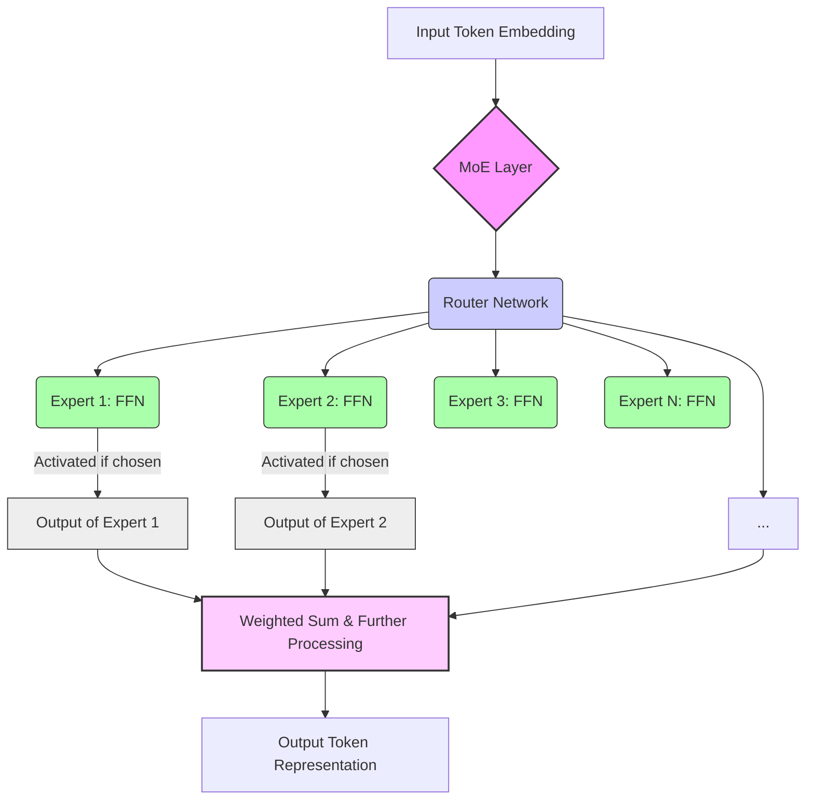

+++
title = "Deep-Dive into DeepSeek's MoE Architecture for LLMs"
date = "2026-07-29"
tags = ["deepseek","LLM","MoE","Mixture of Experts","Hugging Face","ollama","PEFT","LoRA","AI architecture"]
categories = ["artificial-intelligence","machine-learning","deep-learning","open-source","llms"]
banner = "img/banners/2026-07-29-deep-dive-into-deepseeks-moe-architecture-for-llms.jpg"
+++

## Unpacking DeepSeek: The Power of Sparse Mixture-of-Experts in Large Language Models

The landscape of Large Language Models (LLMs) is continuously evolving, with new architectures and training methodologies pushing the boundaries of what's possible. Among the rising stars in the open-source community, DeepSeek models have garnered significant attention, particularly for their innovative application of the **Mixture-of-Experts (MoE)** architecture. This deep dive will go beyond mere performance metrics, dissecting the 'under-the-hood' mechanisms that make DeepSeek models both powerful and efficient.

### The DeepSeek Advantage: Demystifying Mixture-of-Experts (MoE)

At its core, a traditional dense Transformer model activates *all* its parameters for every input token. This can be computationally expensive, especially for models with billions or trillions of parameters. MoE offers an elegant solution: **sparse activation**. Instead of activating everything, MoE models selectively activate only a subset of their parameters – a few "experts" – for each input.

Think of it like this: Imagine you have a complex medical issue. Instead of consulting every doctor in a general hospital, an intelligent routing system directs you to two or three highly specialized doctors (the "experts") whose expertise is most relevant to your specific symptoms. This is far more efficient and often leads to better, more focused treatment.

In DeepSeek's implementation, the MoE layer typically consists of:

*   **A Router (or Gating Network):** This small neural network takes the input representation and decides which `k` out of `N` available "expert" sub-networks should process the input. The output of the router is a set of weights, indicating the contribution of each selected expert.
*   **Multiple Expert Networks:** These are typically feed-forward networks (FFNs) within the Transformer block. Each expert specializes in different types of data patterns or linguistic tasks.

#### Why MoE for LLMs?

1.  **Increased Model Capacity with Reduced Computational Cost:** An MoE model can have a vast number of parameters (e.g., DeepSeek-MoE boasts 236B total parameters but only ~21B are active per token) without a proportional increase in FLOPs during inference or training. This allows for truly massive models to be built and trained more efficiently.
2.  **Faster Inference:** With fewer parameters activated per token, inference latency can be significantly lower than a dense model of equivalent total parameter count, making it practical for real-time applications.
3.  **Enhanced Learning Efficiency:** Experts can specialize, learning distinct patterns or sub-tasks, leading to better overall generalization and performance.

#### DeepSeek's MoE in Action: An Architectural Glimpse

DeepSeek models, notably DeepSeek-MoE and DeepSeek-V2, leverage MoE layers strategically within their Transformer blocks. For instance, DeepSeek-MoE uses 64 experts per MoE layer, activating 2 of them per token. This sparse activation is key to its efficiency. The router learns to effectively distribute tokens across experts, ensuring balanced utilization and preventing "expert collapse" where only a few experts are consistently chosen.



### Architectural Nuances Beyond MoE

While MoE is a significant differentiator, DeepSeek's models integrate other crucial architectural elements:

*   **Attention Mechanisms:** They employ standard multi-head self-attention but often with optimizations for efficiency and context length, such as Rotary Position Embeddings (RoPE).
*   **Normalization and Activation:** Carefully chosen normalization layers (e.g., RMSNorm) and activation functions (e.g., SwiGLU) contribute to training stability and performance.
*   **Training Data Scale and Quality:** DeepSeek models are trained on massive, meticulously curated datasets. For instance, DeepSeek-V2 uses 8.1T tokens of diverse, high-quality data. This extensive pre-training is fundamental to their general capabilities.
*   **DeepSeek-Coder:** A specialized variant, DeepSeek-Coder, showcases how the base architecture can be fine-tuned on code-specific datasets, excelling in programming tasks, code completion, and debugging. This highlights the adaptability of the underlying MoE structure.

### Practical Implementation: Getting DeepSeek to Work

Leveraging DeepSeek models is straightforward, thanks to their integration with popular ML frameworks like Hugging Face Transformers and the growing ecosystem of inference tools.

#### 1. Inference with Hugging Face Transformers (Python)

This example demonstrates how to load and use a DeepSeek-MoE model for text generation. Note that due to their size, running these models locally often requires significant GPU resources or quantized versions.

```python
import torch
from transformers import AutoModelForCausalLM, AutoTokenizer, pipeline

model_name = "deepseek-ai/deepseek-moe-16b-chat"

tokenizer = AutoTokenizer.from_pretrained(model_name)
model = AutoModelForCausalLM.from_pretrained(
    model_name,
    torch_dtype=torch.bfloat16, # Use bfloat16 for reduced memory and faster computation if supported
    device_map="auto"           # Automatically distribute model across available GPUs
)

# Create a chat pipeline for easier interaction
pipe = pipeline(
    "text-generation",
    model=model,
    tokenizer=tokenizer,
    torch_dtype=torch.bfloat16,
    device_map="auto"
)

messages = [
    {"role": "user", "content": "Explain the concept of quantum entanglement in simple terms."},
]

# Generate a response
response = pipe(messages, max_new_tokens=256, temperature=0.7, do_sample=True)

print(response[0]["generated_text"])
```

#### 2. Local Inference with `ollama`

`ollama` provides a convenient way to run quantized versions of DeepSeek models locally on your machine, often leveraging CPU or consumer-grade GPUs.

**Step 1: Install `ollama`** (if you haven't already)

Follow instructions on [ollama.com](https://ollama.com).

**Step 2: Pull a DeepSeek model** (e.g., DeepSeek-Coder-V2)

```bash
ollama pull deepseek-coder:v2
```

**Step 3: Run inference via CLI**

```bash
ollama run deepseek-coder:v2
>>> func fib(n int) int {
func fib(n int) int {
    if n <= 1 {
        return n
    }
    return fib(n-1) + fib(n-2)
}
```

This will launch an interactive session. You can also send a single prompt:

```bash
ollama run deepseek-coder:v2 "Write a Python function to reverse a string."
```

#### 3. Fine-tuning with PEFT (LoRA)

While full fine-tuning of DeepSeek's massive MoE models is resource-intensive, techniques like Parameter-Efficient Fine-Tuning (PEFT), particularly LoRA (Low-Rank Adaptation), make it accessible for domain-specific adaptation.

LoRA works by injecting small, trainable matrices into the existing Transformer layers, freezing the original pre-trained weights. This drastically reduces the number of parameters that need to be trained, making it feasible even on single GPUs.

```python
from transformers import AutoModelForCausalLM, AutoTokenizer, BitsAndBytesConfig
from peft import get_peft_model, LoraConfig, prepare_model_for_kbit_training
import torch

model_name = "deepseek-ai/deepseek-moe-16b-chat"

# 4-bit quantization config (optional, for even lower memory usage)
quantization_config = BitsAndBytesConfig(
    load_in_4bit=True,
    bnb_4bit_quant_type="nf4",
    bnb_4bit_compute_dtype=torch.bfloat16,
    bnb_4bit_use_double_quant=True,
)

tokenizer = AutoTokenizer.from_pretrained(model_name)
model = AutoModelForCausalLM.from_pretrained(
    model_name,
    quantization_config=quantization_config, # Apply quantization
    device_map="auto"
)

# Prepare model for k-bit training (required for 4-bit LoRA)
model = prepare_model_for_kbit_training(model)

# LoRA configuration
lora_config = LoraConfig(
    r=16, # LoRA attention dimension
    lora_alpha=32, # Alpha parameter for LoRA scaling
    target_modules=["q_proj", "v_proj"], # Target query and value projection layers
    lora_dropout=0.05,
    bias="none",
    task_type="CAUSAL_LM"
)

# Apply LoRA to the model
model = get_peft_model(model, lora_config)
model.print_trainable_parameters() # See the drastically reduced trainable parameters

# Now, you would set up your training arguments and Trainer for fine-tuning
# ... (training dataset, DataCollator, TrainingArguments, Trainer)
```

### Performance Benchmarking: DeepSeek's Edge

DeepSeek models consistently rank high on various benchmarks, demonstrating their general intelligence and specialized capabilities. The MoE architecture contributes significantly to achieving this performance while maintaining competitive inference costs.

| Model                  | Total Parameters | Active Parameters | MMLU | HumanEval | MT-Bench (Chat) |
| :--------------------- | :--------------- | :---------------- | :--- | :-------- | :-------------- |
| **DeepSeek-MoE-16B**   | 236B             | ~21B              | 84.1 | -         | 8.3             |
| **DeepSeek-V2**        | 236B             | ~21B              | 86.9 | -         | 8.7             |
| Mixtral 8x22B          | 141B             | ~39B              | 83.7 | 64.0      | -               |
| Llama 3 8B             | 8B               | 8B                | 81.7 | -         | 8.1             |
| Llama 3 70B            | 70B              | 70B               | 86.1 | -         | 8.7             |

*Note: Benchmarks are approximate and can vary based on evaluation setup. "Active Parameters" refers to the number of parameters activated per token during inference.* 

This table highlights how DeepSeek MoE models can achieve performance comparable to much larger dense models (like Llama 3 70B) or even surpass other MoE models (like Mixtral 8x22B) with a similar or even lower active parameter count, underscoring the efficiency of their MoE design.

### Challenges and Future Directions

While MoE offers significant advantages, it introduces its own set of challenges:

*   **Router Optimization:** Designing effective routers that ensure balanced expert utilization and optimal token routing is critical. Poor routing can lead to underutilized experts or suboptimal performance.
*   **Memory Footprint:** Although inference FLOPs are reduced, storing all `N` expert weights can still lead to a substantial memory footprint, especially during training or when deploying unquantized versions.
*   **Load Balancing and Data Parallelism:** Distributing experts across multiple devices and ensuring efficient load balancing during training and inference requires sophisticated engineering.
*   **Fine-tuning Complexity:** Adapting MoE models for downstream tasks can be more complex than dense models, though PEFT methods are mitigating this.

Future research will likely focus on more dynamic routing mechanisms, hierarchical MoE structures, and even more efficient ways to manage expert distribution and specialize them for multimodal tasks. DeepSeek's continued contributions will undoubtedly drive innovation in this exciting area.

### Conclusion

DeepSeek models, with their sophisticated Mixture-of-Experts architecture, represent a significant leap forward in the efficiency and capability of open-source LLMs. By selectively activating expert sub-networks, they achieve high performance with a lower computational burden per token, making them a compelling choice for a wide range of applications. Understanding their 'under-the-hood' mechanics, from MoE routing to practical deployment via Hugging Face or `ollama`, empowers developers and researchers to harness their full potential and contribute to the next generation of intelligent systems.