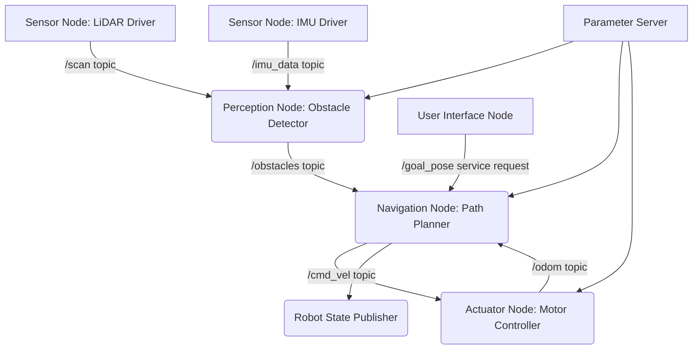

+++
title = "Under the Hood: Deconstructing Robotics with ROS 2 Architectures"
date = "2026-08-16"
tags = ["robotics"]
categories = ["Robotics Engineering","Embedded Systems"]
banner = "img/banners/2026-08-16-under-the-hood-deconstructing-robotics-with-ros-2-architectures.jpg"
+++

# Under the Hood: Deconstructing Robotics with ROS 2 Architectures

Robotics is no longer a futuristic fantasy; it's a rapidly evolving field pushing the boundaries of automation, AI, and embedded systems. From industrial manipulators in factories to autonomous delivery drones and sophisticated surgical assistants, robots are becoming indispensable. But what truly makes these complex machines tick? How do their diverse components – sensors, actuators, and decision-making algorithms – communicate and cooperate seamlessly?

This deep dive eschews generic overviews to explore the underlying architectural patterns and practical implementation challenges in modern robotics, focusing specifically on the **Robot Operating System 2 (ROS 2)**. ROS 2 isn't an operating system in the traditional sense; it's a flexible framework and a collection of tools, libraries, and conventions designed to simplify the development of complex robot applications.

## The Distributed Fabric: Understanding ROS 2 Architecture

At its core, ROS 2 embraces a distributed, decoupled architecture. Instead of monolithic applications, a robot's functionality is broken down into small, independent executable units called **nodes**. These nodes communicate with each other using various messaging patterns, forming a dynamic graph of interconnected processes. This modularity is crucial for scalability, reusability, and robust system design, allowing developers to build complex behaviors by composing simpler, specialized components.

Let's visualize this with a simplified ROS 2 system:


*Figure 1: Simplified ROS 2 System Architecture depicting nodes and communication flows.*

**Key Architectural Concepts in ROS 2:**

*   **Nodes:** Independent executable processes that perform specific tasks (e.g., a sensor driver, a path planner, a motor controller).
*   **Topics:** A publish/subscribe messaging system. Nodes publish messages to topics, and other nodes subscribe to those topics to receive messages. This is ideal for continuous data streams like sensor readings or motor commands.
*   **Services:** A request/reply communication mechanism. A client node sends a request to a service server node and waits for a response. Useful for discrete requests like setting a parameter or triggering an action.
*   **Actions:** A long-running, goal-based communication pattern built on topics and services. A client sends a goal, receives periodic feedback, and eventually a result. Perfect for tasks like "go to location X" which might take time and require intermediate status updates.
*   **Parameters:** Dynamic configuration values that nodes can access and modify. They provide a way to tune node behavior without recompiling code.
*   **ros_tf (Transformation Tree):** A crucial system for keeping track of coordinate frames in a robot. It allows nodes to transform data from one frame to another (e.g., sensor data from a camera frame to the robot's base frame).

## Deeper Dive into Communication Patterns

Understanding how ROS 2 nodes communicate is fundamental to designing robust robot software.

### 1. Topics: Asynchronous Data Streams

Topics are the most common communication mechanism. Imagine a radio station broadcasting information (a publisher) and multiple listeners tuning in (subscribers). Publishers don't care who listens, and subscribers don't care who publishes, as long as they agree on the topic name and message type.

**Example: A Simple Publisher and Subscriber (Python)**

Let's create a `minimal_publisher` that broadcasts "Hello, ROS 2!" messages and a `minimal_subscriber` that receives them.

**`minimal_publisher.py`:**

```python
import rclpy
from rclpy.node import Node
from std_msgs.msg import String

class MinimalPublisher(Node):

    def __init__(self):
        super().__init__('minimal_publisher')
        self.publisher_ = self.create_publisher(String, 'topic', 10)
        timer_period = 0.5  # seconds
        self.timer = self.create_timer(timer_period, self.timer_callback)
        self.i = 0

    def timer_callback(self):
        msg = String()
        msg.data = 'Hello, ROS 2! %d' % self.i
        self.publisher_.publish(msg)
        self.get_logger().info('Publishing: "%s"' % msg.data)
        self.i += 1

def main(args=None):
    rclpy.init(args=args)
    minimal_publisher = MinimalPublisher()
    rclpy.spin(minimal_publisher) # Keep the node alive
    minimal_publisher.destroy_node()
    rclpy.shutdown()

if __name__ == '__main__':
    main()
```

**`minimal_subscriber.py`:**

```python
import rclpy
from rclpy.node import Node
from std_msgs.msg import String

class MinimalSubscriber(Node):

    def __init__(self):
        super().__init__('minimal_subscriber')
        self.subscription = self.create_subscription(
            String,
            'topic',
            self.listener_callback,
            10)
        self.subscription  # prevent unused variable warning

    def listener_callback(self, msg):
        self.get_logger().info('I heard: "%s"' % msg.data)

def main(args=None):
    rclpy.init(args=args)
    minimal_subscriber = MinimalSubscriber()
    rclpy.spin(minimal_subscriber)
    minimal_subscriber.destroy_node()
    rclpy.shutdown()

if __name__ == '__main__':
    main()
```

To run these:

```bash
# In terminal 1
python3 minimal_publisher.py

# In terminal 2
python3 minimal_subscriber.py
```

You'll see the publisher node sending messages and the subscriber node receiving them. The `10` in `create_publisher` and `create_subscription` refers to the *qos_profile* (Quality of Service) history depth, influencing how many messages are buffered.

### 2. Services: Synchronous Request/Reply

Services are used when a node needs to request a specific operation from another node and expects a response. This is a blocking call.

**Example: A Simple Adder Service**

First, define the service interface (`AddTwoInts.srv`) in a package:

```
# Request
int64 a
int64 b
---
# Response
int64 sum
```

Then, generate the necessary message types (usually done automatically during compilation).

**`add_two_ints_server.py`:**

```python
import rclpy
from rclpy.node import Node
from example_interfaces.srv import AddTwoInts # Assuming this service is available or generated

class AddTwoIntsService(Node):

    def __init__(self):
        super().__init__('add_two_ints_server')
        self.srv = self.create_service(AddTwoInts, 'add_two_ints', self.add_two_ints_callback)
        self.get_logger().info('Add Two Ints Service Ready.')

    def add_two_ints_callback(self, request, response):
        response.sum = request.a + request.b
        self.get_logger().info('Incoming request: a = %d, b = %d, sum = %d' % (request.a, request.b, response.sum))
        return response

def main(args=None):
    rclpy.init(args=args)
    add_two_ints_service = AddTwoIntsService()
    rclpy.spin(add_two_ints_service)
    add_two_ints_service.destroy_node()
    rclpy.shutdown()

if __name__ == '__main__':
    main()
```

**`add_two_ints_client.py`:**

```python
import sys
import rclpy
from rclpy.node import Node
from example_interfaces.srv import AddTwoInts

class AddTwoIntsClient(Node):

    def __init__(self):
        super().__init__('add_two_ints_client')
        self.cli = self.create_client(AddTwoInts, 'add_two_ints')
        while not self.cli.wait_for_service(timeout_sec=1.0):
            self.get_logger().info('service not available, waiting again...')
        self.req = AddTwoInts.Request()

    def send_request(self, a, b):
        self.req.a = a
        self.req.b = b
        self.future = self.cli.call_async(self.req)
        rclpy.spin_until_future_complete(self, self.future) # Blocks until response is received
        return self.future.result()

def main(args=None):
    rclpy.init(args=args)
    client = AddTwoIntsClient()
    response = client.send_request(int(sys.argv[1]), int(sys.argv[2]))
    client.get_logger().info('Result of add_two_ints: for %d + %d = %d' % (int(sys.argv[1]), int(sys.argv[2]), response.sum))
    client.destroy_node()
    rclpy.shutdown()

if __name__ == '__main__':
    main()
```

To run these:

```bash
# In terminal 1
python3 add_two_ints_server.py

# In terminal 2
python3 add_two_ints_client.py 5 7
```

The client will send `5` and `7`, and the server will return `12`.

### 3. Actions: Asynchronous, Goal-Based Execution

Actions are a more complex pattern for long-running tasks that require feedback and the ability to be cancelled or preempted. Think of a robot navigating to a specific target. It can't instantly teleport. An action client sends a goal (`go to X,Y`), the action server accepts it, provides continuous feedback (`robot is 5m away`, `robot is turning`), and finally returns a result (`reached X,Y`).

**Key components of an Action:**
*   **Goal:** The desired state or task.
*   **Feedback:** Intermediate status updates from the server to the client.
*   **Result:** The final outcome of the action.

ROS 2 provides an `action_msgs` package to define action types. Similar to services, you define an `.action` file (e.g., `Fibonacci.action`):

```
# Goal
int32 order
---
# Result
int32[] sequence
---
# Feedback
int32[] partial_sequence
```

Implementing an action server and client is more involved, typically using the `rclpy.action` module, but follows the same node communication principles.

## The Challenge of Perception: Sensor Data Fusion

Robots rarely rely on a single sensor. For accurate perception and robust autonomy, fusing data from multiple sensors is critical. This often involves combining heterogeneous data sources like LiDAR (for distance), IMUs (Inertial Measurement Units for orientation and acceleration), cameras (for visual information), and encoders (for wheel odometry).

**Why Fuse?**
*   **Completeness:** Each sensor has blind spots or limitations.
*   **Accuracy:** Combining data can reduce noise and improve overall precision.
*   **Robustness:** Redundancy makes the system resilient to individual sensor failures.

A common technique for state estimation (e.g., a robot's pose) from noisy sensor data is the **Extended Kalman Filter (EKF)** or **Particle Filter**. While the mathematics of these filters are outside a direct code example for a blog post, understanding how ROS 2 facilitates their implementation is key.

**ROS 2 and Sensor Fusion:**
1.  **Standard Message Types:** ROS 2 provides standard message types for common sensor data (`sensor_msgs/msg/LaserScan`, `sensor_msgs/msg/Imu`, `nav_msgs/msg/Odometry`). This ensures interoperability.
2.  **`ros_tf` (Transformation Tree):** This is paramount. An EKF or any localization algorithm needs sensor data expressed in a common coordinate frame (e.g., the robot's base_link). `ros_tf` allows nodes to publish transformations between frames and query them to convert data.

    **Example: Publishing a Static TF Transform (CLI)**

    ```bash
    ros2 run tf2_ros static_transform_publisher --x 0.1 --y 0.0 --z 0.2 --roll 0.0 --pitch 0.0 --yaw 0.0 --frame-id base_link --child-frame-id lidar_link
    ```
    This command tells the `tf2` system that a `lidar_link` frame is located 0.1m in front and 0.2m above the `base_link` frame, with no rotation. Sensor readings from the LiDAR can then be transformed into the robot's coordinate system.

3.  **`robot_localization` Package:** A powerful ROS 2 package providing EKF and UKF (Unscented Kalman Filter) nodes. It subscribes to odometry sources (wheel encoders, IMU, visual odometry, GPS) and publishes a fused, more accurate `odom` or `map` transform.

    **Snippet of a `robot_localization` EKF configuration (YAML):**

    ```yaml
    # ekf_node.yaml
ekf_filter_node:
  ros__parameters:
    frequency: 30.0
    sensor_timeout: 0.1
    two_d_mode: true # For 2D differential drive robots
    publish_tf: true
    base_link_frame: base_link
    odom_frame: odom
    map_frame: map

    # Input sources
    odom0: odom_encoder # Odom from wheel encoders
    odom0_config: [true, true, false,
                   false, false, true,
                   true, true, false,
                   false, false, true,
                   false, false, false] # x,y,z, roll,pitch,yaw, vx,vy,vz, vroll,vpitch,vyaw, ax,ay,az
    odom0_differential: false
    odom0_queue_size: 10

    imu0: imu_data # IMU data
    imu0_config: [false, false, false,
                  true, true, true,  # Use orientation (roll, pitch, yaw)
                  false, false, false,
                  true, true, true,  # Use angular velocities
                  false, false, false] # Don't use linear accelerations for localization directly (prone to drift)
    imu0_differential: false
    imu0_remove_gravitational_acceleration: true
    imu0_queue_size: 10
    ```
    This YAML configuration shows how to configure an EKF node to fuse `odom_encoder` (likely wheel odometry) and `imu_data`. The `odom0_config` and `imu0_config` matrices specify which variables (position, velocity, orientation) from each sensor source should be used in the filter, allowing fine-grained control over the fusion process.

## Actuation and Control Loops

Once the robot knows where it is and where it wants to go, it needs to move. This involves translating high-level commands (e.g., "move forward at 0.5 m/s") into low-level motor signals.

### PID Control

Many robotic systems rely on **PID (Proportional-Integral-Derivative) controllers** for precise actuation. A PID controller calculates an "error" value as the difference between a desired setpoint and a measured process variable, then applies a correction based on three terms:

*   **Proportional (P):** Reacts to the current error.
*   **Integral (I):** Accounts for past errors, reducing steady-state error.
*   **Derivative (D):** Predicts future errors based on the rate of change.

**Simplified PID Controller Logic (Conceptual Python):**

```python
class PIDController:
    def __init__(self, kp, ki, kd, output_limits=(-1.0, 1.0)):
        self.kp = kp
        self.ki = ki
        self.kd = kd
        self.output_limits = output_limits
        self.previous_error = 0
        self.integral = 0
        self.dt = 0.01 # Time step

    def update(self, setpoint, measured_value):
        error = setpoint - measured_value

        self.integral += error * self.dt
        derivative = (error - self.previous_error) / self.dt

        output = (self.kp * error) + (self.ki * self.integral) + (self.kd * derivative)

        # Apply output limits
        output = max(self.output_limits[0], min(self.output_limits[1], output))

        self.previous_error = error
        return output

# Example usage: control motor speed
# pid = PIDController(kp=0.5, ki=0.1, kd=0.05)
# target_speed = 1.0 # m/s
# current_speed = get_motor_speed() # from encoder
# motor_command = pid.update(target_speed, current_speed)
# send_command_to_motor_driver(motor_command)
```

### ROS 2 and `ros_control`

For complex robots with multiple joints and actuators, `ros_control` is the go-to framework in ROS 2. It provides a standardized interface for interacting with robot hardware, abstracting away the specifics of motor drivers, encoders, and sensor types.

**Key concepts in `ros_control`:**
*   **Hardware Interface:** A C++ class that communicates directly with the robot's physical hardware (e.g., serial communication, EtherCAT, CAN bus).
*   **Controllers:** Implement control logic (e.g., PID for position, velocity, effort). These are standard ROS 2 nodes that use the hardware interface to read states and send commands.
*   **Controller Manager:** Manages the lifecycle of controllers (loading, starting, stopping).

**Example: A `ros_control` configuration for a differential drive robot (YAML)**

This snippet shows how a `diff_drive_controller` is configured to work with joint names and PID gains.

```yaml
# diff_drive_controller.yaml
diff_drive_controller:
  ros__parameters:
    publish_rate: 50.0 # Hz
    left_wheel_names: ["left_wheel_joint"]
    right_wheel_names: ["right_wheel_joint"]
    wheel_separation: 0.35 # meters
    wheel_radius: 0.05     # meters

    # Velocity PID Gains for wheels
    linear_velocity_pid:
      p: 1.0
      i: 0.1
      d: 0.01
      i_clamp_min: -0.5
      i_clamp_max: 0.5
    angular_velocity_pid:
      p: 1.0
      i: 0.1
      d: 0.01
      i_clamp_min: -0.5
      i_clamp_max: 0.5
    
    # Odometry settings
    odom_frame_id: odom
    base_frame_id: base_link
    enable_odom_tf: true
```
This configuration would be loaded by the `controller_manager` node, which then starts the `diff_drive_controller`. This controller subscribes to `cmd_vel` (command velocity) topics, calculates the required wheel speeds, and sends these to the hardware interface, which in turn commands the actual motors. It also publishes odometry based on wheel encoder readings.

## Practical Implementation Challenges and Best Practices

Developing robotics applications is riddled with unique challenges:

*   **Real-time Performance:** Many robot tasks (e.g., collision avoidance, high-speed control) demand deterministic, low-latency execution. While ROS 2 has improved real-time capabilities over ROS 1 (using RMW implementations like Fast DDS), careful node design and operating system tuning are still critical.
*   **Debugging Distributed Systems:** Tracking down issues in a system with dozens of interconnected nodes, topics, and services across multiple processes or even machines can be incredibly complex. Tools like `rqt_graph` (for visualizing the computation graph), `ros2 topic echo`, `ros2 service call`, and `ros2 bag` (for recording and replaying data) are indispensable.
*   **Hardware Abstraction:** Writing drivers for every new sensor or motor controller is tedious. `ros_control`, `sensor_msgs` and other standard interfaces aim to minimize this effort, promoting code reuse.
*   **Coordinate Frame Management (`tf` Hell):** Incorrect transformations between coordinate frames are a common source of bugs. Consistent use of `ros_tf` and careful definition of static and dynamic transforms are essential.
*   **Safety and Reliability:** For physical robots, errors can have real-world consequences. Redundancy, fault tolerance, robust error handling, and careful testing are paramount.

**Best Practices:**
*   **Modularity:** Keep nodes small, single-purpose, and loosely coupled.
*   **Standard Messages:** Leverage `std_msgs`, `sensor_msgs`, `geometry_msgs` etc., to ensure interoperability.
*   **Version Control:** Always use Git for code management.
*   **Testing:** Implement unit tests for individual nodes and integration tests for system components. `ament_lint` and `ament_cmake` provide tooling.
*   **Documentation:** Clear documentation of node APIs, topics, services, and parameters is vital for team collaboration.

## Conclusion

Building sophisticated robotic systems requires more than just clever algorithms; it demands a robust, scalable, and maintainable software architecture. ROS 2 provides exactly that – a powerful framework that abstracts away much of the underlying complexity, allowing developers to focus on higher-level robot intelligence.

By understanding its distributed nature, mastering its communication patterns (topics, services, actions), and leveraging its rich ecosystem for challenges like sensor fusion and motor control, engineers can build the next generation of intelligent, autonomous machines. The journey under the hood reveals a fascinating world of interconnected processes, real-time data streams, and carefully orchestrated control loops, all working in harmony to bring robots to life.
