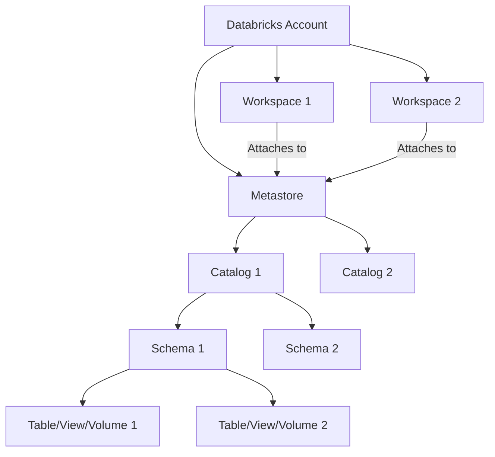

+++
title = "Databricks Under the Hood: Delta Lake, Photon, and Unity Catalog Deconstructed"
date = "2026-09-02"
tags = ["databricks","delta-lake","photon-engine","unity-catalog","lakehouse","data-architecture","data-engineering"]
categories = ["Data Engineering"]
banner = "img/banners/2026-09-02-databricks-under-the-hood-delta-lake-photon-and-unity-catalog-deconstructed.jpg"
+++

Databricks has revolutionized the data landscape, providing a unified platform for data engineering, machine learning, and analytics. While its user-friendly interface and managed Spark capabilities are well-known, the true power lies in its meticulously engineered core components. This deep dive aims to peel back the layers, exploring the architectural nuances, practical challenges, and 'under-the-hood' mechanisms of Databricks' foundational technologies: Delta Lake, Photon Engine, and Unity Catalog.

At the heart of Databricks' vision for the Lakehouse is a sophisticated interplay of these systems, each addressing critical aspects of data reliability, performance, and governance.

## 1. Delta Lake: The Transactional Foundation of Your Lakehouse

Delta Lake is an open-source storage layer that brings ACID transactions, scalable metadata handling, and unified streaming and batch data processing to data lakes. It's not just a file format; it's a protocol built atop Parquet, enhancing reliability and performance.

### 1.1. The Transaction Log: How ACID is Achieved

Every Delta table maintains a transaction log (located in the `_delta_log` subdirectory of the table path). This log is an ordered, atomic record of every change made to the table, including data file additions/deletions, schema changes, and table property modifications. Each change is recorded as a JSON file, and periodically, these JSON files are compacted into Parquet-based checkpoint files for faster reading.

**Analogy**: Think of the transaction log as a bank's ledger. Every deposit, withdrawal, or transfer is meticulously recorded, ensuring that the bank's balance is always consistent and recoverable. If the system crashes, the ledger can be replayed to restore the correct state.

Let's inspect a simplified view of a transaction log entry:

```json
{
  "commitInfo": {
    "timestamp": 1678886400000,
    "operation": "WRITE",
    "operationParameters": {
      "mode": "Append",
      "partitionBy": "[]"
    },
    "isBlindAppend": true
  },
  "add": {
    "path": "part-00000-guid.snappy.parquet",
    "size": 12345,
    "modificationTime": 1678886400000,
    "dataChange": true,
    "stats": "{\"numRecords\":100,\"minValues\":{},\"maxValues\":{},\"nullCount\":{}}"
  }
}
```

This JSON snippet describes an `add` action, indicating a new Parquet file was added. Other actions include `remove` (for deleting files), `metadata` (for schema changes), and `protocol` (for updating Delta Lake protocol versions).

### 1.2. Time Travel (Data Versioning)

Because the transaction log records every change, Delta Lake can reconstruct the state of a table at any point in time. This is invaluable for auditing, rolling back bad writes, or reproducing experiments. Each commit to the transaction log corresponds to a version of the table.

To query an older version:

```python
# Query by version
df_v0 = spark.read.format("delta").option("versionAsOf", 0).load("/tmp/delta_table")

# Query by timestamp
df_yesterday = spark.read.format("delta").option("timestampAsOf", "2023-03-14").load("/tmp/delta_table")
```

To view the history of a Delta table:

```sql
DESCRIBE HISTORY delta.`/tmp/delta_table`;
```

This will return a table showing each version, commit details, operations, and user information.

### 1.3. Schema Enforcement and Evolution

Delta Lake automatically enforces schema on writes, preventing bad data from corrupting your tables. However, it also supports controlled schema evolution for scenarios where your data naturally changes over time (e.g., adding a new column).

**Schema Enforcement**: By default, if an incoming DataFrame's schema doesn't match the table's schema, the write fails.

**Schema Evolution**: You can explicitly allow schema changes using the `mergeSchema` option or `ALTER TABLE ADD COLUMN` for SQL. This adds new columns to the table schema and fills existing records for that column with `null` values.

```python
# Example of schema evolution during an append operation
from pyspark.sql.types import StructType, StructField, StringType, IntegerType

# Original schema
original_schema = StructType([
    StructField("id", IntegerType(), True),
    StructField("name", StringType(), True)
])

data1 = [(1, "Alice"), (2, "Bob")]
df1 = spark.createDataFrame(data1, original_schema)
df1.write.format("delta").mode("overwrite").save("/tmp/delta_table_schema")

# New data with an additional column 'city'
new_schema = StructType([
    StructField("id", IntegerType(), True),
    StructField("name", StringType(), True),
    StructField("city", StringType(), True)
])
data2 = [(3, "Charlie", "New York"), (4, "David", "London")]
df2 = spark.createDataFrame(data2, new_schema)

# Append with mergeSchema option
df2.write.format("delta")\
    .mode("append")\
    .option("mergeSchema", "true")\
    .save("/tmp/delta_table_schema")

# The table now has the 'city' column
spark.read.format("delta").load("/tmp/delta_table_schema").printSchema()
```

## 2. Photon Engine: Turbocharging Apache Spark Workloads

Photon is a vectorized query engine that makes your existing Spark SQL and DataFrame API calls faster on Databricks. It's written in C++ and is designed to provide ultra-fast performance for data ingestion, ETL, data warehousing, and data science workloads.

### 2.1. Beyond JIT: A Native C++ Engine

Traditional Apache Spark relies on the JVM and bytecode interpretation/JIT compilation. While powerful, this can introduce overheads, especially for high-throughput, low-latency analytical queries. Photon fundamentally changes this by replacing parts of Spark's execution engine with a highly optimized, native C++ implementation.

**Key characteristics of Photon:**
*   **Vectorized Query Processing**: Processes data in batches (vectors) rather than row-by-row, leveraging CPU cache lines and SIMD instructions for significant performance gains.
*   **Data Layout Optimization**: Works efficiently with columnar data formats (like Parquet) and uses techniques like dictionary encoding and run-length encoding.
*   **Optimized Operators**: Provides highly optimized implementations for common SQL operators like joins, aggregations, sorts, and scans.
*   **Seamless Integration**: Photon automatically kicks in when available on a Photon-enabled cluster, requiring no code changes from the user for most workloads.

**Analogy**: Imagine Spark as a powerful, general-purpose truck. It can carry anything, but sometimes you need to move specific goods very quickly. Photon is like replacing the truck's engine with a custom-built, high-performance racing engine designed specifically for speed and efficiency when hauling those specific goods.

### 2.2. Enabling and Verifying Photon

Photon is enabled by default on Databricks Runtime 9.1 LTS and above, specifically for 'Photon-enabled' cluster types.

**Cluster Configuration (JSON snippet):**
When creating a cluster, you'd select a Databricks Runtime version that includes Photon. The JSON configuration would look something like this (simplified):

```json
{
  "cluster_name": "my-photon-cluster",
  "spark_version": "13.3.x-scala2.12-photon-cpu-ml-standard",
  "node_type_id": "i3.xlarge",
  "autoscale": {
    "min_workers": 2,
    "max_workers": 8
  },
  "num_workers": 3
}
```

Notice the `photon-cpu` in the `spark_version`. This indicates a Photon-enabled runtime.

**Verifying Photon usage in Spark UI**: In the Spark UI (available via the Databricks cluster UI), you can inspect query plans. Operations accelerated by Photon will often show `Photon` prefixes or indicators in the execution plan details, like `Photon: Scan` or `Photon: HashAggregate`.

### 2.3. Practical Considerations

While Photon significantly boosts performance, not all Spark operations are Photon-accelerated. Operations involving UDFs (User-Defined Functions), complex nested data types, or certain legacy Spark APIs might still fall back to the JVM-based Spark engine. Databricks continuously expands Photon's coverage, but it's crucial to profile and monitor your workloads to understand where performance gains are realized.

## 3. Unity Catalog: The Unified Governance Layer

Unity Catalog is Databricks' fine-grained governance solution for data and AI on the Lakehouse. It provides a centralized approach to security, auditing, discovery, and access control across all your Databricks workspaces and data assets.

### 3.1. Centralized Metastore Architecture

Unlike traditional Spark metastores tied to individual clusters or workspaces, Unity Catalog introduces a centralized metastore that can be shared across multiple Databricks workspaces in the same Databricks account. This allows for a single source of truth for metadata and permissions.

**Architectural Hierarchy:**



*   **Metastore**: The top-level container for all Unity Catalog metadata and permissions.
*   **Catalog**: The first layer of data organization, analogous to a database in traditional systems. Users can create separate catalogs for different projects, teams, or environments.
*   **Schema (Database)**: The next layer, containing tables, views, and volumes.
*   **Table/View/Volume**: The actual data objects.

### 3.2. Granular Access Control and Identity Federation

Unity Catalog enforces access control at the table, row, and column level, directly integrating with your existing identity provider (Azure Active Directory, Okta, etc.). Permissions are managed using standard SQL `GRANT` and `REVOKE` statements.

**Example: Granting Permissions**

```sql
-- Grant SELECT on a specific table to a user
GRANT SELECT ON TABLE main.default.sales_data TO `user_alice@example.com`;

-- Grant USAGE on a schema and SELECT on all tables in it to a group
GRANT USAGE ON SCHEMA main.analytics TO `data_analysts_group`;
GRANT SELECT ON ALL TABLES IN SCHEMA main.analytics TO `data_analysts_group`;

-- Grant CREATE TABLE and CREATE VOLUME on a catalog to a group
GRANT CREATE TABLE, CREATE VOLUME ON CATALOG raw_data TO `data_engineers_group`;
```

This SQL-centric approach makes access management familiar to data professionals and facilitates automated permission provisioning.

### 3.3. External Locations and Storage Credentials

For tables backed by external cloud storage (e.g., S3, ADLS Gen2), Unity Catalog uses 'External Locations' and 'Storage Credentials' to securely manage access without exposing cloud access keys to users. Storage credentials abstract the underlying cloud access (e.g., IAM role, service principal), while external locations map a cloud storage path to a logical name within Unity Catalog.

**Databricks CLI Example: Creating an External Location**

First, define a storage credential (e.g., using an Azure service principal or an AWS IAM role):

```bash
# Example for Azure Data Lake Storage Gen2 using Service Principal
databricks unity-catalog storage-credentials create --name "my_adls_credential" \
    --azure-service-principal "tenant_id=<tenant-id>,client_id=<client-id>,client_secret=<client-secret>"
```

Then, create an external location referencing this credential:

```bash
databricks unity-catalog external-locations create --name "raw_data_location" \
    --url "abfss://raw@myadlsaccount.dfs.core.windows.net/" \
    --credential-name "my_adls_credential"
```

Now, users with appropriate permissions on `raw_data_location` can create tables pointing to paths within `abfss://raw@myadlsaccount.dfs.core.windows.net/` without directly needing the service principal credentials.

## 4. Architectural Pattern: The Medallion Architecture on Databricks

The Medallion Architecture (Bronze, Silver, Gold layers) is a robust and widely adopted data architecture pattern on Databricks, leveraging Delta Lake for its reliability and ACID properties across all stages.

```mermaid
graph LR
    Source[External Data Sources] --> Bronze[Bronze Layer (Raw Data)]
    Bronze --> Silver[Silver Layer (Cleaned & Conformed)]
    Silver --> Gold[Gold Layer (Aggregated & Business-Ready)]
    Gold --> Analytics[Reporting & Analytics]
    Gold --> ML[Machine Learning Models]

    subgraph Data Processing on Databricks
        Bronze -- Delta Lake --> Silver
        Silver -- Delta Lake --> Gold
    end
```

*   **Bronze Layer**: Ingests raw data from various sources (streaming or batch) into Delta tables with minimal transformation. The goal is to preserve the raw, immutable history. Schema enforcement is typically relaxed (`mergeSchema=true`) to accommodate schema drift in source systems.

    ```python
    # Example: Ingesting raw JSON into Bronze Delta table
    raw_json_df = spark.read.format("json").load("/mnt/landing_zone/raw_events/")
    raw_json_df.write.format("delta")\
        .mode("append")\
        .option("mergeSchema", "true")\
        .saveAsTable("bronze.raw_events")
    ```

*   **Silver Layer**: Takes data from the Bronze layer, applies cleansing, filtering, standardization, and enrichment logic. Data is often de-duplicated, sensitive information is masked, and data types are corrected. This layer aims for a "single source of truth" for enterprise data.

    ```python
    # Example: Cleaning and conforming raw events to Silver
    from pyspark.sql.functions import col, current_timestamp, sha2

    bronze_events_df = spark.read.table("bronze.raw_events")

    silver_events_df = bronze_events_df.filter(col("event_timestamp").isNotNull())\
        .withColumn("processed_timestamp", current_timestamp())\
        .withColumn("hashed_user_id", sha2(col("user_id"), 256))

    silver_events_df.write.format("delta")\
        .mode("overwrite")\
        .option("overwriteSchema", "true")\
        .saveAsTable("silver.cleaned_events")
    ```

*   **Gold Layer**: Aggregates, transforms, and joins data from the Silver layer into highly optimized, denormalized models tailored for specific business use cases (e.g., sales dashboards, customer analytics, ML feature stores). This layer is designed for performance and ease of consumption by end-users and applications.

    ```sql
    -- Example: Creating a Gold layer aggregate table
    CREATE OR REPLACE TABLE gold.daily_sales_summary
    AS SELECT
        DATE(sale_timestamp) AS sale_date,
        product_category,
        SUM(sale_amount) AS total_sales,
        COUNT(DISTINCT customer_id) AS distinct_customers
    FROM silver.sales_transactions
    GROUP BY 1, 2;
    ```

This tiered approach ensures data quality, governance, and optimized performance at each stage, making it a scalable and maintainable pattern for building a modern Lakehouse.

## Conclusion: The Integrated Power of the Databricks Lakehouse

Databricks' strength lies in the seamless integration and synergistic effects of its core components. Delta Lake provides the transactional reliability and data quality foundation, Photon turbocharges the analytical workloads, and Unity Catalog establishes a unified, granular governance framework across the entire data estate.

Understanding these 'under-the-hood' details empowers data professionals to design more resilient, performant, and secure data solutions on Databricks. As the platform continues to evolve, these foundational elements will remain critical, enabling organizations to unlock the full potential of their data and AI initiatives within a true Lakehouse architecture.
