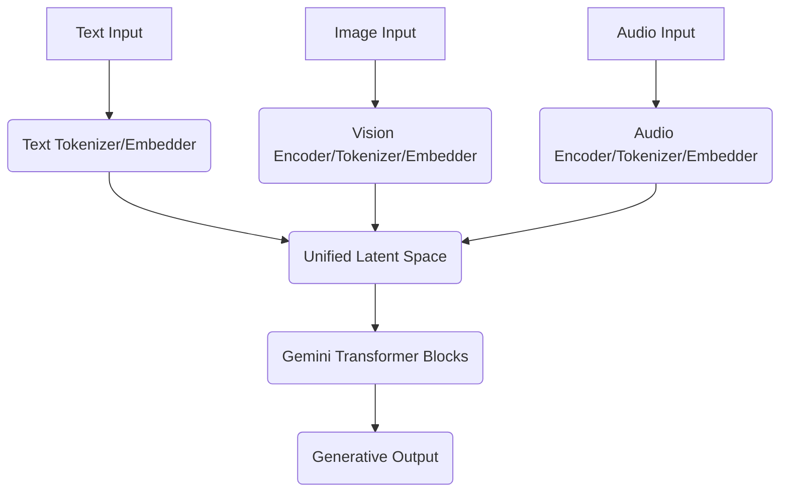
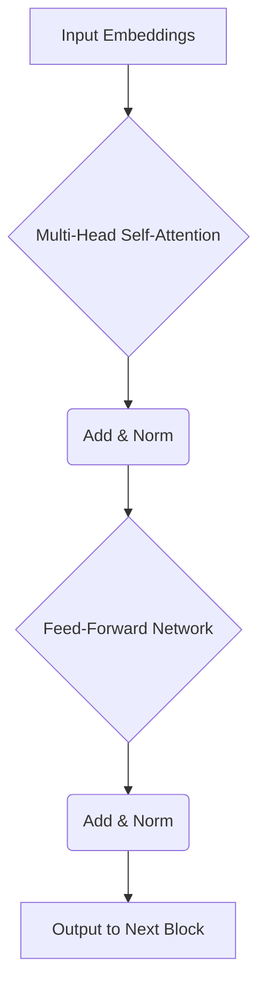

+++
title = "Gemini Under the Hood: Architectural Nuances for Practical Implementation"
date = "2026-09-06"
tags = ["gemeni"]
categories = ["category1"]
banner = "img/banners/2026-09-06-gemini-under-the-hood-architectural-nuances-for-practical-implementation.jpg"
+++

Gemini, Google's family of powerful, multimodal AI models, has redefined what's possible in generative AI. Beyond the impressive demos and high-level capabilities, understanding its underlying architecture and practical interaction patterns is crucial for developers and data scientists looking to leverage its full potential. This deep dive moves beyond marketing claims to explore Gemini's core components, how it handles multimodality, and key considerations for implementation.

### The Multimodal Transformer Core: A Unified Latent Space

At its heart, Gemini is a sophisticated Transformer architecture. What sets it apart is its **native multimodality**. Unlike previous approaches that often bolted on separate encoders for different modalities (e.g., a CNN for vision, an RNN for audio) and then merged their outputs, Gemini processes various data types—text, images, audio, video—within a *single* coherent framework. This is achieved by converting all input modalities into a shared, high-dimensional latent space through specialized tokenization and embedding layers.

Imagine you're building a universal translator. Instead of having separate translators for 'English to French' and 'image to description', you build a system that understands the *core meaning* regardless of the input format. That's Gemini's ambition.

#### How Multimodality Converges:

1.  **Modality-Specific Encoders**: Each input type (e.g., pixels for images, audio waveforms, text characters) first passes through a modality-specific encoder. These encoders are neural networks (like vision transformers for images, specialized audio transformers for sound) optimized to extract features pertinent to their domain.
2.  **Shared Tokenization**: The output of these encoders is then transformed into a sequence of discrete tokens. For text, these are often subword units. For images or audio, they might be 'visual tokens' or 'audio tokens' representing patches or segments, akin to how text is broken down.
3.  **Unified Embeddings**: These tokens are then mapped into a shared embedding space. This is where the magic happens: a text token representing 'cat' and a visual token representing an image of a cat occupy semantically similar regions in this embedding space. This allows the subsequent Transformer layers to process them together, understanding cross-modal relationships directly.

Here's a simplified view of the input processing pipeline:



### Deconstructing the Transformer Block

The unified sequence of embeddings then feeds into Gemini's deep stack of Transformer decoder blocks. While the exact architecture details are proprietary, it's safe to assume a highly optimized, sparsely activated (potentially Mixture-of-Experts, or MoE) variant of the decoder-only Transformer.

Each core Transformer block generally consists of:

*   **Multi-Head Self-Attention**: Allows the model to weigh the importance of different parts of the input sequence (and previously generated output) when processing each token. In a multimodal context, this means attention can be drawn between a text query and relevant parts of an image, or between different segments of an audio clip and accompanying text.
*   **Feed-Forward Networks (FFN)**: These are standard dense neural networks applied independently to each position in the sequence, providing non-linear transformations.
*   **Residual Connections & Layer Normalization**: Crucial for training very deep networks, ensuring stable gradients and faster convergence.



For Gemini Ultra, the largest variant, the scale is immense. This implies massive numbers of parameters, trained on vast datasets across Google's specialized AI accelerators (TPUs). This scale allows for emergent capabilities and a deeper understanding of complex patterns across modalities.

### Practical Interaction: Gemini API and Multimodal Prompts

Interacting with Gemini typically happens via an API, such as through Google Cloud's Vertex AI platform or the `google-generativeai` Python library. The key is how you structure your prompt to leverage its multimodal capabilities.

Let's walk through an example of asking Gemini to analyze an image and provide a textual description and insights.

First, ensure you have the necessary library installed:

```bash
pip install -q -U google-generativeai
```

Next, authenticate and initialize the model. For simplicity, we'll assume API key authentication here. For production, consider OAuth2 or service accounts with Vertex AI.

```python
import os
import google.generativeai as genai
import PIL.Image

# --- Configuration (replace with your actual API key or Vertex AI setup) ---
# It's recommended to set your API key as an environment variable
# export GOOGLE_API_KEY='YOUR_API_KEY'
API_KEY = os.environ.get('GOOGLE_API_KEY')
if not API_KEY:
    raise ValueError("GOOGLE_API_KEY environment variable not set.")
genai.configure(api_key=API_KEY)

# Choose the appropriate Gemini model (e.g., 'gemini-pro-vision' for multimodal tasks)
# For text-only, use 'gemini-pro'. For complex multimodal, 'gemini-1.5-pro' is ideal.
model = genai.GenerativeModel('gemini-1.5-pro')

# --- Prepare Multimodal Input ---
# We'll use a placeholder image. In a real scenario, load from file or URL.
# For local testing, you might use: PIL.Image.open('path/to/your/image.jpg')
# Let's create a dummy image for demonstration
def create_dummy_image(width=100, height=100, color=(255, 0, 0)):
    img = PIL.Image.new('RGB', (width, height), color)
    return img

# Imagine this is an image of a cat on a keyboard
image_part = create_dummy_image(200, 150, color=(100, 150, 200)) # Blueish hue

# The prompt can now combine text and image
multimodal_prompt_parts = [
    "Describe this image in detail and suggest a creative caption for social media.",
    image_part,
    "Also, speculate on the context or what might be happening here."
]

# --- Generate Content ---
print("\n--- Generating Content with Gemini ---")
response = model.generate_content(multimodal_prompt_parts)

# --- Process Response ---
try:
    print(response.text)
    # Accessing candidate responses and safety ratings
    if response.candidates:
        for i, candidate in enumerate(response.candidates):
            print(f"\nCandidate {i+1} Safety Ratings:")
            for rating in candidate.safety_ratings:
                print(f"  Category: {rating.category.name}, Probability: {rating.probability.name}")
except ValueError as e:
    print(f"Error generating content: {e}")
    # If the response contains blocked content, response.text will raise a ValueError
    # Check response.prompt_feedback.safety_ratings instead
    if response.prompt_feedback and response.prompt_feedback.safety_ratings:
        print("Prompt feedback (blocked content likely due to safety policies):")
        for rating in response.prompt_feedback.safety_ratings:
            print(f"  Category: {rating.category.name}, Probability: {rating.probability.name}")

```

In this example, `multimodal_prompt_parts` is a list that interweaves strings and `PIL.Image` objects. Gemini's API automatically handles the serialization and encoding of these different types into the unified format it expects.

#### Configuration Parameters (JSON/YAML Example):

When making API calls, you often need to control the generation process. Here's a common set of parameters, often passed as a `generation_config` dictionary (or JSON payload) to the `generate_content` method:

```json
{
  "temperature": 0.7, 
  "top_p": 0.9, 
  "top_k": 40, 
  "max_output_tokens": 800, 
  "candidate_count": 1, 
  "stop_sequences": [
    "\n\n---"
  ]
}
```

| Parameter          | Description                                                                                                                                                                                                                             |
| :----------------- | :-------------------------------------------------------------------------------------------------------------------------------------------------------------------------------------------------------------------------------------- |
| `temperature`      | Controls the randomness of the output. Higher values (e.g., 1.0) make the output more creative/diverse, lower values (e.g., 0.2) make it more deterministic/focused. Ranges from 0.0 to 1.0.                                            |
| `top_p`            | Nucleus sampling. The model considers tokens whose cumulative probability mass adds up to `top_p`. Reduces the vocabulary to more probable tokens. Ranges from 0.0 to 1.0.                                                              |
| `top_k`            | Top-K sampling. The model considers the `top_k` most probable tokens at each step. Combined with `top_p` for more nuanced control. Ranges from 1 to N (where N is vocabulary size).                                                        |
| `max_output_tokens`| The maximum number of tokens to generate in the response. Helps control response length and API costs.                                                                                                                                |
| `candidate_count`  | The number of alternative responses to generate. Useful for exploring different outputs but increases compute cost.                                                                                                                     |
| `stop_sequences`   | A list of strings that, if encountered in the generated text, will cause the model to stop generating further output. Useful for controlling output format or preventing run-on sentences.                                                 |

### Challenges and Best Practices for Gemini Implementation

Implementing Gemini effectively comes with its own set of considerations:

1.  **Prompt Engineering for Multimodality**: Crafting effective multimodal prompts is an art. It's not just about throwing all data at the model. The *order* of elements (text, image, video frames) can influence the model's focus. Experiment with placing the core question near the relevant modal input.

    *   **Bad Prompt**: "What's in this image? Also, give me a recipe." *[image here]*
    *   **Better Prompt**: "*[image here]* Describe the main subject of this image in detail. Then, based on the ingredients you see, suggest a simple recipe."

2.  **Latency and Throughput**: For real-time applications, inference latency is critical. Gemini models, especially larger variants, can have significant latency. Optimizations include:
    *   **Batching**: Sending multiple requests in a single API call to improve throughput, though it might slightly increase per-request latency.
    *   **Asynchronous Calls**: Using non-blocking API calls to prevent your application from waiting. (The `google-generativeai` library supports `async` methods).
    *   **Model Selection**: Using smaller, more efficient models (`gemini-1.5-flash` or `gemini-pro`) for less complex tasks where latency is paramount.

3.  **Cost Optimization**: API calls are typically billed per token (input + output). Multimodal inputs, especially high-resolution images or video frames, can translate to a higher number of internal 'tokens' and thus higher costs.
    *   **Efficient Input**: Only send necessary data. Don't send a 4K image if a downscaled version suffices for the task.
    *   **Max Output Tokens**: Limit `max_output_tokens` to prevent unnecessarily long responses.
    *   **Caching**: Cache common responses or use Retrieval Augmented Generation (RAG) to reduce repeated calls for static knowledge.

4.  **Safety and Responsible AI**: Gemini includes built-in safety filters to prevent the generation of harmful content (hate speech, sexual content, violence, self-harm). While essential, these filters can sometimes be overly cautious. Understand the `safety_settings` API (where you can adjust thresholds, if allowed for your use case) and how to handle blocked responses gracefully.

    ```python
    # Example of overriding safety settings (use with caution and only if necessary)
    safety_settings = {
        "HARM_CATEGORY_HATE_SPEECH": genai.types.HarmBlockThreshold.BLOCK_NONE,
        "HARM_CATEGORY_SEXUALLY_EXPLICIT": genai.types.HarmBlockThreshold.BLOCK_NONE, # Example - generally not recommended
    }
    # model.generate_content(prompt_parts, safety_settings=safety_settings)
    ```

    *Note: Adjusting safety settings to `BLOCK_NONE` is generally not recommended for production applications and should only be considered for very specific, controlled research or testing scenarios after careful ethical review.*

### Looking Ahead: The Future of Multimodal AI

Gemini represents a significant leap towards more capable and versatile AI. Its unified multimodal architecture paves the way for applications that were previously fragmented or impossible: conversational AI that truly 'sees' and 'hears', intelligent assistants that understand context across all human communication channels, and advanced content generation that blends visual and textual creativity.

As developers, understanding these underlying mechanisms and practical considerations will enable us to build more robust, efficient, and innovative solutions with Gemini, pushing the boundaries of what AI can achieve in real-world scenarios.
