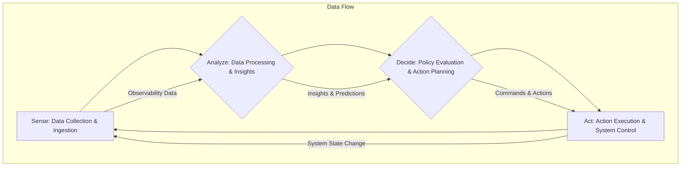

+++
title = "Under the Hood: Mastering Loop Engineering for Autonomous Systems"
date = "2026-09-30"
tags = ["loop-engineering","autonomous-systems","system-design","feedback-loops","devops","mlops","event-driven-architecture","kubernetes"]
categories = ["System Design","Automation"]
banner = "img/banners/2026-09-30-under-the-hood-mastering-loop-engineering-for-autonomous-systems.jpg"
+++

In the quest for increasingly autonomous and self-optimizing systems, **Loop Engineering** emerges as a critical discipline. Far beyond simple iterative programming constructs, it's the art and science of designing, building, and managing sophisticated feedback loops that enable systems to observe, analyze, decide, and act (OODA/SADA) in response to dynamic environments. For the DataFibers Community, this isn't just theory; it's the architectural bedrock for resilient distributed systems, advanced MLOps pipelines, and intelligent infrastructure automation.

This deep dive will peel back the layers, exploring the architectural patterns, implementation challenges, and under-the-hood mechanisms that power true loop-engineered systems.

## The Anatomy of a Feedback Loop: SADA in Action

At its core, a feedback loop is a continuous process. While various models exist (like the OODA loop – Observe, Orient, Decide, Act), for technical systems, the **SADA** (Sense, Analyze, Decide, Act) model provides a practical framework.

Let's break down each stage:

*   **Sense (Observe/Collect):** This is the system's 'eyes and ears.' It involves collecting raw data, metrics, logs, and events from various sources. Think telemetry, sensor data, application logs, network traffic, database changes, or user interactions.
    *   *Engineering Focus:* High-throughput data ingestion, schema validation, real-time streaming capabilities (e.g., Apache Kafka, Flink, Prometheus exporters).
*   **Analyze (Orient/Process):** Here, raw data is transformed into actionable insights. This stage performs aggregation, correlation, anomaly detection, pattern recognition, predictive modeling (ML inference), or complex event processing.
    *   *Engineering Focus:* Stream processing engines, distributed analytical databases, machine learning model serving infrastructure.
*   **Decide (Plan/Policy):** Based on the analysis, this stage determines the appropriate course of action. It can involve policy engines, rule-based systems, optimization algorithms, reinforcement learning agents, or simple thresholding logic.
    *   *Engineering Focus:* Low-latency policy evaluation, declarative configuration for rules, A/B testing decision strategies.
*   **Act (Execute/Control):** This is where the system takes physical or logical action. It could be scaling resources, rerouting traffic, triggering alerts, updating configurations, applying security patches, or even invoking external business processes.
    *   *Engineering Focus:* Idempotent action execution, robust API clients, workflow orchestrators, error handling and retry mechanisms.

Here's a conceptual flow diagram of the SADA loop:



## Architectural Patterns for Robust Loop Engineering

Implementing these loops effectively requires a combination of modern architectural patterns, especially in distributed cloud-native environments.

### 1. Event-Driven Microservices

Loose coupling and asynchronous communication are paramount. Event streams become the backbone, allowing each SADA component to operate independently and scale autonomously.

*   **Sense:** Microservices publish events (e.g., `OrderPlaced`, `ServiceMetricUpdated`) to an event bus.
*   **Analyze/Decide:** Dedicated microservices or serverless functions subscribe to relevant event streams, process them, and publish new 'decision' events (e.g., `ScaleUpRequired`, `FraudDetected`).
*   **Act:** Other microservices subscribe to decision events and invoke actions (e.g., call `k8s-api.scaleDeployment()`, `sendAlert()`).

#### Example: A Simple 'Analyze-Decide' Loop with Kafka and Python

Let's imagine a scenario where we're monitoring CPU utilization and want to scale an application if it goes too high.

**`metrics-producer.py` (Simulates 'Sense' publishing metrics):**

```python
import json
import time
import random
from kafka import KafkaProducer

producer = KafkaProducer(bootstrap_servers='kafka:9092',
                         value_serializer=lambda v: json.dumps(v).encode('utf-8'))

print('Starting metrics producer...')
while True:
    cpu_util = random.uniform(30.0, 95.0) # Simulate varying CPU
    metric_data = {
        'service_id': 'web-app-v1',
        'metric_name': 'cpu_utilization',
        'value': round(cpu_util, 2),
        'timestamp': int(time.time())
    }
    print(f'Sending metric: {metric_data}')
    producer.send('service_metrics', metric_data)
    time.sleep(random.uniform(0.5, 2.0))
```

**`autoscaler-policy.py` ('Analyze' and 'Decide' logic):**

```python
import json
from kafka import KafkaConsumer, KafkaProducer

# Consumer for metrics
consumer = KafkaConsumer('service_metrics',
                         bootstrap_servers='kafka:9092',
                         auto_offset_reset='earliest',
                         enable_auto_commit=True,
                         group_id='autoscaler-group',
                         value_deserializer=lambda x: json.loads(x.decode('utf-8')))

# Producer for actions
producer = KafkaProducer(bootstrap_servers='kafka:9092',
                         value_serializer=lambda v: json.dumps(v).encode('utf-8'))

SCALE_THRESHOLD = 80.0 # CPU utilization percentage
CURRENT_REPLICAS = 1 # Initial state, ideally fetched from an external system

print('Starting autoscaler policy engine...')
for message in consumer:
    metric = message.value
    service_id = metric.get('service_id')
    cpu_util = metric.get('value')

    print(f'Received metric for {service_id}: CPU={cpu_util}%')

    if service_id == 'web-app-v1': # Apply policy to specific service
        if cpu_util > SCALE_THRESHOLD and CURRENT_REPLICAS < 5: # Max 5 replicas
            CURRENT_REPLICAS += 1
            action = {
                'service_id': service_id,
                'action_type': 'SCALE_UP',
                'new_replicas': CURRENT_REPLICAS,
                'timestamp': int(time.time())
            }
            print(f'DECISION: Scaling up {service_id} to {CURRENT_REPLICAS} replicas.')
            producer.send('system_actions', action)
        elif cpu_util < (SCALE_THRESHOLD - 10) and CURRENT_REPLICAS > 1: # Scale down with hysteresis
            CURRENT_REPLICAS -= 1
            action = {
                'service_id': service_id,
                'action_type': 'SCALE_DOWN',
                'new_replicas': CURRENT_REPLICAS,
                'timestamp': int(time.time())
            }
            print(f'DECISION: Scaling down {service_id} to {CURRENT_REPLICAS} replicas.')
            producer.send('system_actions', action)
        else:
            print('No action needed.')
```

**`action-executor.py` ('Act' logic):**

```python
import json
import time
from kafka import KafkaConsumer

consumer = KafkaConsumer('system_actions',
                         bootstrap_servers='kafka:9092',
                         auto_offset_reset='earliest',
                         enable_auto_commit=True,
                         group_id='action-executor-group',
                         value_deserializer=lambda x: json.loads(x.decode('utf-8')))

print('Starting action executor...')
for message in consumer:
    action = message.value
    service_id = action.get('service_id')
    action_type = action.get('action_type')
    new_replicas = action.get('new_replicas')

    print(f'EXECUTING ACTION: {action_type} for {service_id} to {new_replicas} replicas.')
    # In a real system, this would call a Kubernetes API, cloud provider API, etc.
    # For this example, we just simulate the action.
    time.sleep(1) # Simulate API call latency
    print(f'Action completed for {service_id}. Current state: {new_replicas} replicas.')

    # Crucially, the 'Act' component's action *changes the system state*,
    # which should then be 'Sense'd by the next iteration of the loop.
```

### 2. Kubernetes Operators and Declarative Control Loops

Kubernetes Operators are a prime example of declarative loop engineering. They extend Kubernetes' capabilities by continuously observing the desired state (defined in Custom Resources) and taking actions to reconcile the actual state with the desired state.

```yaml
apiVersion: mycompany.com/v1alpha1
kind: DatabaseCluster
metadata:
  name: my-app-db
spec:
  engine: postgresql
  version: '14'
  replicas: 3 # Desired state: 3 replicas
  storage: 100Gi
  autoscale:
    enabled: true
    cpuThreshold: 75 # Sense: CPU utilization
    minReplicas: 1
    maxReplicas: 5 # Decide: Scaling policy
```

An Operator (the 'Analyze', 'Decide', and 'Act' components) would:

1.  **Sense:** Monitor the actual `DatabaseCluster` pods' CPU usage and the `replicas` field of the Custom Resource.
2.  **Analyze:** Compare actual CPU usage against `autoscale.cpuThreshold`.
3.  **Decide:** Determine if scaling up or down is needed, respecting `minReplicas` and `maxReplicas`.
4.  **Act:** Update the `replicas` field of the underlying StatefulSet/Deployment, or even modify the `DatabaseCluster` Custom Resource itself to reflect a new desired state.

### 3. Service Mesh for Policy Enforcement and Telemetry

A service mesh (e.g., Istio, Linkerd) can significantly contribute to loop engineering:

*   **Sense:** Sidecar proxies collect rich telemetry (metrics, traces, access logs) for all inter-service communication, providing a granular view of system behavior.
*   **Act:** The mesh's policy engine can enforce decisions made by the `Decide` component, such as rate limiting, traffic routing, circuit breaking, or authentication/authorization changes, without modifying application code.

## Practical Implementation Challenges

Building robust feedback loops is complex. Here are critical challenges and engineering considerations:

1.  **Latency and Throughput:**
    *   **Challenge:** Loops need to react within acceptable timeframes. High-volume data streams can overwhelm processing stages.
    *   **Engineering:** Use highly performant stream processing (Spark Streaming, Flink, Kafka Streams), asynchronous communication, distributed caching for decision logic, and low-latency data stores.

2.  **State Consistency and Idempotency:**
    *   **Challenge:** Actions might be retried or processed multiple times in distributed systems. Side effects must be predictable.
    *   **Engineering:** Design 'Act' components to be idempotent. Use transaction logs or persistent queues for state transitions. Ensure the 'Decide' stage uses consistent state (e.g., transactional updates to a shared decision state).

3.  **Observability of the Loop Itself:**
    *   **Challenge:** Understanding if the loop is healthy, effective, or stuck. Monitoring data flow, decision accuracy, and action success rates.
    *   **Engineering:** Instrument every SADA stage with detailed metrics, logs, and traces. Monitor queues (e.g., Kafka consumer lag). Visualize the loop's state and performance end-to-end. Implement circuit breakers and alarms for critical path failures.

    ```bash
    # Example: Check Kafka consumer lag for the autoscaler
    kafka-consumer-groups --bootstrap-server kafka:9092 --describe --group autoscaler-group

    # Expected output (simplified):
    # GROUP           TOPIC           PARTITION  CURRENT-OFFSET  LOG-END-OFFSET  LAG             CONSUMER-ID     HOST            CLIENT-ID
    # autoscaler-group service_metrics 0          12345           12345           0               consumer-1      /172.17.0.4     consumer-1
    ```
    A non-zero `LAG` indicates the `Analyze/Decide` component is falling behind.

4.  **Backpressure and Resilience:**
    *   **Challenge:** What happens if the 'Act' component is slow or unavailable, causing a backlog?
    *   **Engineering:** Implement backpressure mechanisms in streaming pipelines. Use dead-letter queues for failed actions. Design 'Act' components with retry policies and exponential backoff. Isolate components with bulkheads.

5.  **Policy Management and Versioning:**
    *   **Challenge:** Decision logic ('Decide') evolves. How to update rules without downtime, rollback bad policies, and perform A/B testing?
    *   **Engineering:** Externalize policies (e.g., as YAML/JSON configuration, decision tables, or dedicated policy engines like Open Policy Agent). Implement version control for policies. Use blue/green deployments or canary releases for policy changes.

## Engineering for Robustness, Scalability, and Intelligence

*   **Decoupling:** Treat each SADA component as an independent service that communicates via well-defined APIs or event contracts. This maximizes scalability and fault isolation.
*   **Idempotency:** Crucial for 'Act' components. An operation should produce the same result whether executed once or multiple times.
*   **Declarative vs. Imperative:** Prefer declarative approaches where possible (e.g., desired state in Kubernetes) for simpler management and better reconciliation. Use imperative actions for complex, one-off operations.
*   **Human-in-the-Loop:** For critical or highly uncertain decisions, design for human override or approval workflows. Gradually increase automation confidence.
*   **Testing and Simulation:** Rigorously test loops in simulated environments. Use chaos engineering to test resilience. A/B test different decision policies to validate their effectiveness.

## Conclusion

Loop Engineering is not merely a concept; it's a fundamental paradigm shift towards building truly autonomous, adaptive, and resilient systems. By meticulously designing the 'Sense, Analyze, Decide, Act' cycle, leveraging event-driven architectures, and addressing inherent distributed systems challenges, we empower our applications and infrastructure to heal themselves, optimize performance, and respond intelligently to an ever-changing world. Mastering these principles is key to unlocking the next generation of self-managing data platforms and AI-powered services in the DataFibers ecosystem and beyond.
